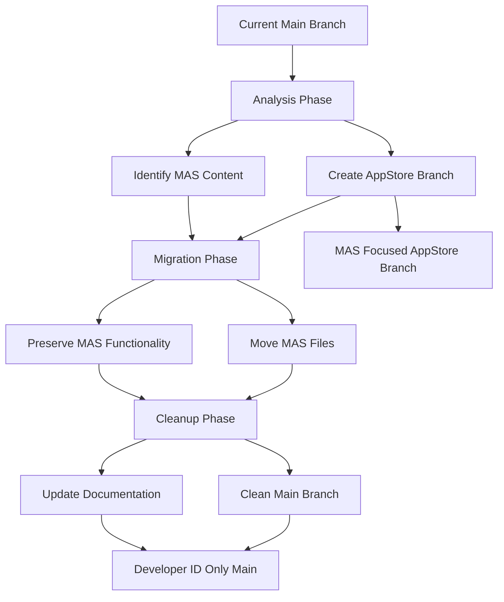

# MAS to AppStore Migration Design Document

## Overview

This design outlines the migration strategy for separating Mac App Store (MAS) related content from the main branch to a dedicated appstore branch. The main branch will focus exclusively on Developer ID distribution, while the appstore branch will maintain all MAS-specific functionality and restrictions. This separation ensures cleaner development workflows and clearer distribution strategies.

## Architecture

The migration follows a three-phase approach:

1. **Analysis Phase**: Identify all MAS-related content across the codebase
2. **Migration Phase**: Create appstore branch and move MAS content
3. **Cleanup Phase**: Remove MAS content from main branch and update documentation



## Components and Interfaces

### MAS Content Scanner

A utility component that identifies MAS-related content across the codebase:

- **File Scanner**: Identifies files containing MAS-specific code patterns
- **Build Configuration Parser**: Locates MAS compilation flags and settings
- **Documentation Analyzer**: Finds MAS references in documentation
- **Dependency Checker**: Identifies MAS-specific package configurations

### Branch Manager

Handles Git operations for branch creation and content migration:

- **Branch Creator**: Creates the appstore branch from current main state
- **Content Migrator**: Moves identified MAS content to appstore branch
- **Cleanup Manager**: Removes MAS content from main branch

### Documentation Updater

Updates documentation to reflect the new branch structure:

- **README Updater**: Modifies README to focus on Developer ID
- **Build Guide Updater**: Updates build instructions for both branches
- **Architecture Documentation**: Updates design documents

## Data Models

### MAS Content Item

```swift
struct MASContentItem {
    let path: String
    let type: MASContentType
    let description: String
    let migrationAction: MigrationAction
}

enum MASContentType {
    case sourceFile
    case buildConfiguration
    case documentation
    case projectFile
    case resource
}

enum MigrationAction {
    case moveToAppStore
    case removeFromMain
    case updateInPlace
}
```

### Migration Plan

```swift
struct MigrationPlan {
    let masContentItems: [MASContentItem]
    let branchStrategy: BranchStrategy
    let cleanupActions: [CleanupAction]
    let documentationUpdates: [DocumentationUpdate]
}
```

## Correctness Properties

*A property is a characteristic or behavior that should hold true across all valid executions of a system-essentially, a formal statement about what the system should do. Properties serve as the bridge between human-readable specifications and machine-verifiable correctness guarantees.*

### Property Reflection

After reviewing all identified properties, several can be consolidated:
- Properties 1.1, 4.1, 4.2, 4.3, 4.4, 4.5 all relate to main branch cleanup and can be combined into a comprehensive "main branch cleanliness" property
- Properties 1.2, 3.2, 3.3, 3.4 all relate to preservation in appstore branch and can be combined
- Properties 2.1, 2.2, 2.3, 2.4, 2.5 all relate to content identification and can be combined
- Properties 5.1, 5.2, 5.3, 5.4, 5.5 all relate to documentation updates and can be combined

### Property 1: Main Branch Cleanliness
*For any* file or configuration in the main branch after migration, it should contain no MAS-specific patterns, flags, or references
**Validates: Requirements 1.1, 4.1, 4.2, 4.3, 4.4, 4.5**

### Property 2: Content Identification Completeness
*For any* MAS-related pattern or configuration in the codebase, the scanner should identify and categorize it correctly
**Validates: Requirements 2.1, 2.2, 2.3, 2.4, 2.5**

### Property 3: Migration Preservation
*For any* MAS-specific functionality that existed before migration, it should be preserved and functional in the appstore branch
**Validates: Requirements 1.2, 1.5, 3.2, 3.3, 3.4**

### Property 4: Build Configuration Separation
*For any* build configuration, main branch should contain only Developer ID settings while appstore branch should contain only MAS settings
**Validates: Requirements 1.3, 4.2, 5.2**

### Property 5: Documentation Consistency
*For any* documentation file, it should accurately reflect the branch's distribution focus and provide clear guidance
**Validates: Requirements 1.4, 3.5, 5.1, 5.3, 5.4, 5.5**

## Error Handling

### Migration Errors

- **File Not Found**: Handle cases where identified MAS files no longer exist
- **Permission Errors**: Handle Git operation failures due to permissions
- **Merge Conflicts**: Handle potential conflicts during branch operations
- **Incomplete Migration**: Detect and report partially migrated content

### Validation Errors

- **Scanner False Positives**: Handle incorrectly identified MAS content
- **Missing Dependencies**: Handle cases where MAS content depends on non-MAS files
- **Build Failures**: Validate that both branches build successfully after migration

## Testing Strategy

### Unit Testing

- Test MAS content scanner with known patterns
- Test branch operations with mock Git repositories
- Test documentation updaters with sample files
- Test migration plan generation and validation

### Property-Based Testing

Property-based tests will verify the correctness properties using a Swift property testing framework like SwiftCheck:

- Generate random codebases with known MAS patterns
- Verify scanner identifies all patterns correctly
- Verify migration preserves all functionality
- Verify cleanup removes all MAS content from main
- Test with various file structures and content combinations

### Integration Testing

- Test complete migration workflow on sample repositories
- Verify both branches build and function correctly after migration
- Test documentation accuracy and completeness
- Validate CI/CD pipeline separation