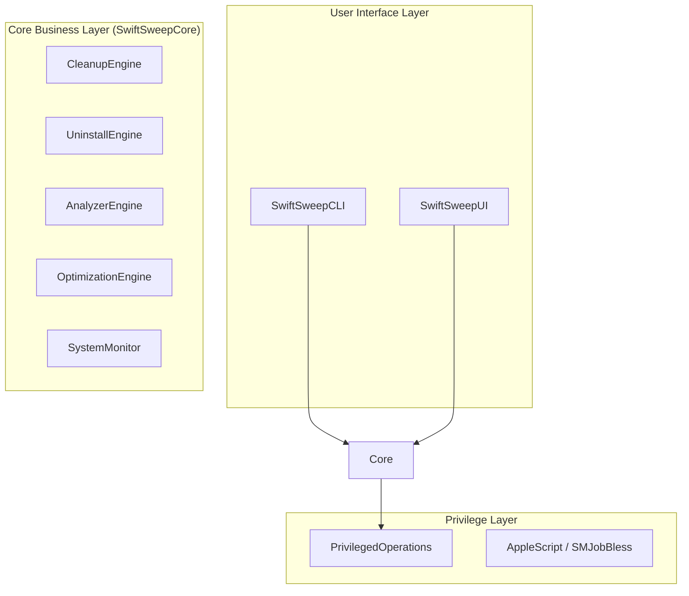

# SwiftSweep 项目设计文档

## 1. 项目概述

SwiftSweep 是一个原生的 macOS 系统清理与优化工具，旨在提供现代化、高性能且用户友好的体验。它复刻并扩展了 Mole 的功能，完全使用 Swift 和 SwiftUI 构建，包含命令行界面 (CLI) 和图形用户界面 (GUI)。

> **核心目标**: 提供安全、高效的 macOS 系统维护方案，替代传统的 Shell 脚本工具。

---

## 2. 架构设计

采用模块化架构，核心逻辑与 UI 分离，确保 CLI 和 GUI 共享相同的业务逻辑。



### 2.1 核心模块 (SwiftSweepCore)

| 模块 | 职责 | 状态 |
|------|------|------|
| **CleanupEngine** | 扫描和清理系统缓存、日志、浏览器数据 (Chrome/Safari/Firefox) | ✅ 已完成 |
| **UninstallEngine** | 扫描已安装应用，识别残留文件 (Preferences, Caches, Application Support) | ✅ 已完成 |
| **AnalyzerEngine** | 递归扫描磁盘，分析目录大小，Top N 大文件排序 | ✅ 已完成 (从 AnalyzeViewModel 迁移) |
| **OptimizationEngine** | 执行系统优化任务 (DNS, Spotlight, RAM, Dock) | ✅ 已完成 |
| **SystemMonitor** | 实时监控 CPU、内存、磁盘、网络、电池指标 | ✅ 已完成 |

### 2.2 权限管理

SwiftSweep 支持两种特权操作模式：

1. **AppleScript (当前默认)**: 
   - 使用 `NSAppleScript` 和 `do shell script ... with administrator privileges`。
   - 优点：无需复杂的 Xcode 项目配置，开箱即用。
   - 缺点：每次操作可能需要用户输入密码（取决于系统策略），体验稍逊。

2. **SMJobBless (高级集成)**:
   - 使用 Apple 官方推荐的 Privileged Helper Tool 机制。
   - 优点：一次授权，长期有效，安全性高，体验好。
   - 缺点：需要严格的 Xcode 项目结构和代码签名配置 (详见 `SMJOBBLESS_GUIDE.md`)。

---

## 3. 功能详细规格

### 3.1 清理 (Clean)
- **扫描范围**: 
  - 用户缓存 (`~/Library/Caches`)
  - 系统日志 (`/Library/Logs`, `~/Library/Logs`)
  - 浏览器缓存 (Chrome, Safari, Firefox)
  - 废纸篓 (`~/.Trash`)
  - 开发垃圾 (`node_modules`, `.DS_Store` 等 - 计划中)
- **安全机制**: 
  - 白名单保护关键文件
  - `--dry-run` 模式预演清理

### 3.2 卸载 (Uninstall)
- **应用发现**: 扫描 `/Applications` 和 `~/Applications`。
- **关联查找**: 基于 Bundle ID 智能查找关联的残留文件。
- **操作**: 将应用及其残留文件移至废纸篓或直接删除。

### 3.3 分析 (Analyze)
- **磁盘可视化**: 快速分析指定目录。
- **性能优化**: 
  - 后台线程扫描，不阻塞 UI。
  - 实时进度反馈 (扫描数、大小)。
  - 智能跳过 (`node_modules`, `.git`) 以提升速度。
- **大文件定位**: 自动列出最大的 20 个文件/文件夹。

### 3.4 优化 (Optimize)
- **Flush DNS Cache**: 解决网络访问问题。
- **Rebuild Spotlight**: 修复搜索功能。
- **Clear Memory (Purge)**: 释放非活跃内存。
- **Reset Dock/Finder**: 修复界面异常。

---

## 4. UI/UX 设计 (SwiftUI)

### 4.1 导航结构
采用两栏式布局 (`NavigationSplitView`)，左侧侧边栏导航，右侧内容区。

| 视图 | 功能描述 |
|------|----------|
| **Dashboard (Status)** | 仪表盘展示系统健康度、实时资源监控 (CPU/内存环形图)。 |
| **CleanView** | 清理扫描结果列表，按类别分组，一键清理按钮。 |
| **UninstallView** | 应用列表搜索，点击展开显示关联文件，右侧卸载按钮。 |
| **AnalyzeView** | 路径选择器，扫描进度条，大文件列表 (支持 Finder 跳转)。 |
| **OptimizeView** | 网格布局展示优化任务卡片，带图标和说明，"Run" 按钮。 |
| **SettingsView** | 通用设置，Helper 安装状态管理，关于页面。 |

### 4.2 交互细节
- **暗色模式支持**: 全面适配 macOS Dark Mode。
- **动画**: 扫描进度条、环形图动态加载。
- **反馈**: 操作成功/失败的 Toast 或 Alert 提示。

---

## 5. 项目结构与文件

```
SwiftSweep/
├── Package.swift               # SPM 配置
├── Sources/
│   ├── SwiftSweepCore/         # 核心逻辑
│   │   ├── CleanupEngine/
│   │   ├── UninstallEngine/
│   │   ├── SystemMonitor/
│   │   └── PrivilegedHelper/   # Helper 客户端代码
│   ├── SwiftSweepCLI/          # 命令行入口
│   │   ├── Commands/           # ArgumentParser 命令
│   │   └── main.swift
│   └── SwiftSweepUI/           # UI 界面
│       ├── App/                # App 入口
│       ├── Views/              # 各功能视图
│       ├── ViewModels/         # MVVM 逻辑
│       └── Resources/          # Assets, Icons
├── Helper/                     # SMJobBless Helper 源码 (用于 Xcode 项目)
│   ├── main.swift
│   ├── Info.plist
│   └── launchd.plist
└── Tests/                      # 单元测试
```

---

## 6. 开发路线图 (Roadmap)

### Phase 1: 基础架构 (已完成 ✅)
- [x] SPM 项目结构搭建
- [x] 核心引擎移植 (Cleanup, SystemMonitor)
- [x] CLI 基础命令实现

### Phase 2: UI 实现 (已完成 ✅)
- [x] SwiftUI 界面框架
- [x] 各功能模块 UI 实现
- [x] `AnalyzeView` 性能优化 (后台扫描)

### Phase 3: 权限系统 (进行中 🔄)
- [x] 方案 A: AppleScript 临时提权 (已实现)
- [ ] 方案 B: SMJobBless 完整集成 (Xcode 项目结构已备好，待配置)

### Phase 4: 完善与发布 (计划中 📅)
- [ ] 完善 Uninstall 逻辑 (实际删除操作)
- [ ] 增加更多清理规则 (Xcode 缓存, Docker 清理)
- [ ] 单元测试覆盖
- [ ] 代码签名与公证 (Notarization)
