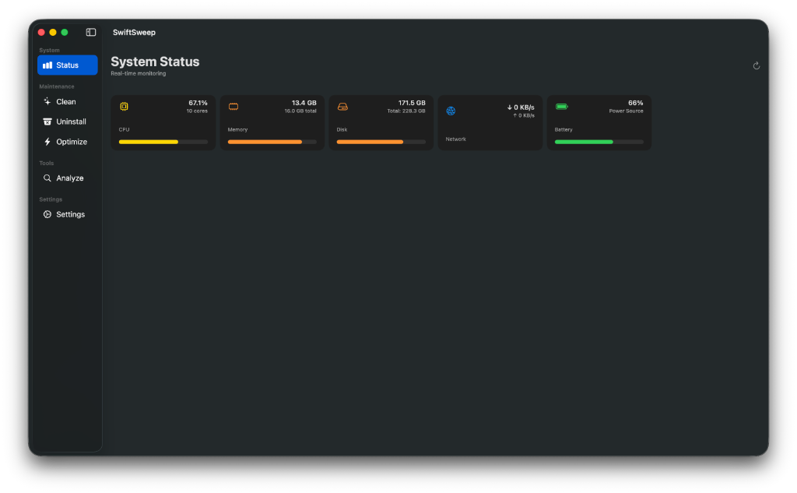
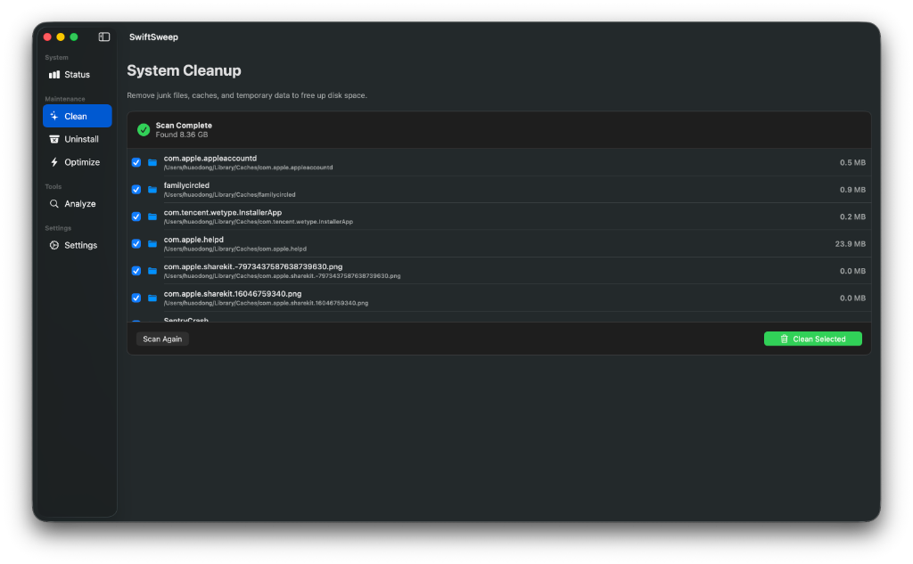
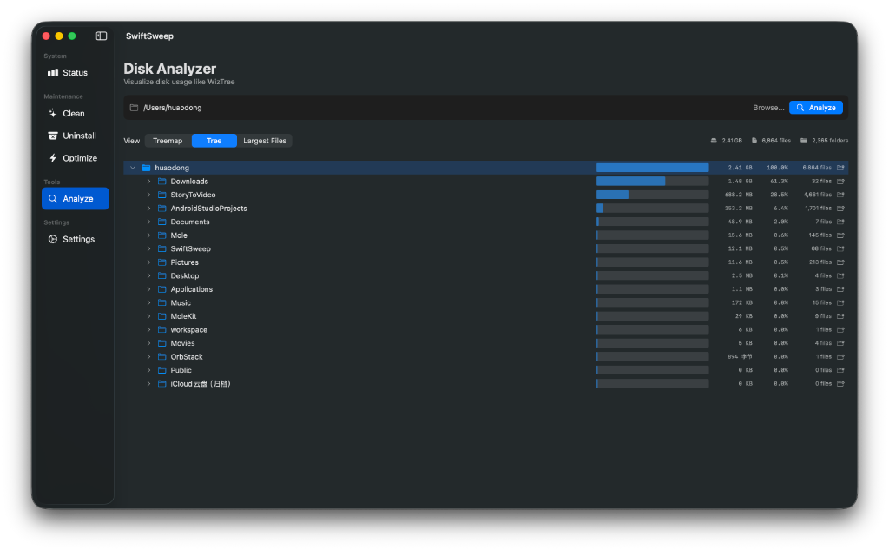
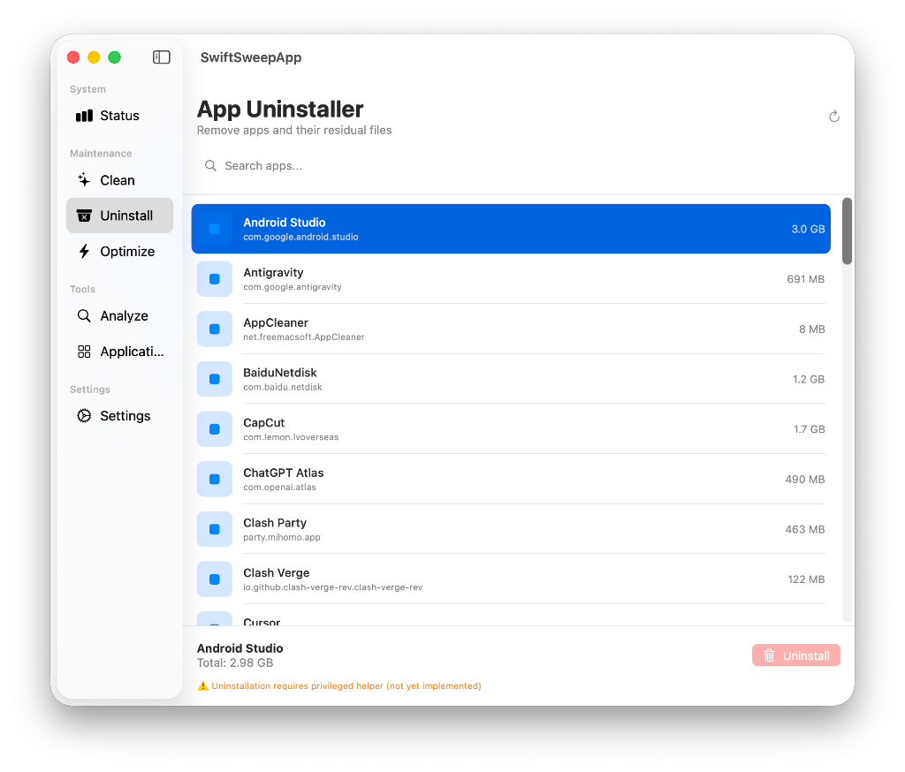
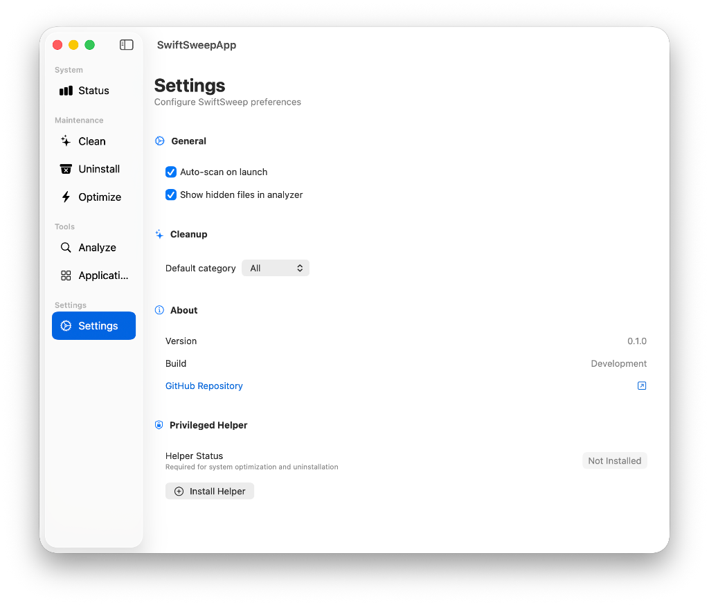

# SwiftSweep

<p align="center">
  <strong>🧹 原生 macOS 系统清理与优化工具</strong>
</p>

<p align="center">
  使用 Swift 和 SwiftUI 构建的现代化系统维护工具
</p>

<p align="center">
  
  
  
</p>

---

## ✨ 特性

- 🧠 **Smart Insights** — 基于规则的智能建议（证据 / 风险 / 置信度 / 预估收益），支持预览与一键清理
- 🎨 **原生 SwiftUI** — 现代化 macOS 界面，支持暗色模式
- 🔍 **磁盘分析** — Treemap / Tree / Top Files 三种视图，WizTree 风格定位大文件
- 🗑️ **应用卸载** — 残留扫描 + 删除计划预览 + 执行
- ⚡ **系统优化** — DNS 刷新、Spotlight 重建、内存清理、Dock/Finder 重置、字体缓存清理
- 📦 **包与仓库管理** — Homebrew/npm/pip/gem 扫描与管理（卸载/升级），并支持 Git 仓库发现与维护（状态/体积/GC/Prune）
- 🧩 **模块化架构** — CLI + GUI 共享 `SwiftSweepCore`
- 🛡️ **安全至上** — 预览模式 (dry-run)、二次确认、移入废纸篓优先、执行审计日志、权限受控（Helper / AppleScript）

---

## 🖥️ 界面预览

SwiftSweep 采用两栏式布局，包含以下功能模块：

| 模块 | 功能 |
|------|------|
| **Status** | 系统仪表盘，实时监控 CPU、内存、磁盘 |
| **Insights** | 智能建议：低磁盘空间、旧下载文件、开发者缓存、浏览器缓存、废纸篓提醒等 |
| **Clean** | 清理系统缓存、日志、浏览器数据 |
| **Uninstall** | 完整卸载应用及其残留文件 |
| **Optimize** | 系统优化（DNS 刷新、Spotlight 重建等）|
| **Analyze** | 磁盘空间分析，定位大文件 (WizTree 风格) |
| **Applications** | 应用清单：筛选/分类/深度扫描应用体积，并可一键跳转卸载 |
| **Packages** | 包与仓库管理：Homebrew/npm/pip/gem + Git Repos（包卸载/升级，Git GC/Prune） |
| **Ghost Buster** | 孤儿包检测：识别无依赖包，支持影响分析与删除 |
| **Galaxy** | 依赖图可视化：Canvas 渲染、力导向布局、LOD 优化、交互式探索 |
| **Time Machine** | 快照管理：捕获包状态、导出/导入、Diff 对比、影响预警 |
| **Settings** | 偏好设置与 Helper 管理 |

### 功能要点（Current）

- **Insights 规则（内置）**：低磁盘空间、旧下载文件、开发者缓存、超大缓存、浏览器缓存、桌面旧截图/临时文件、废纸篓提醒、邮件附件、未使用应用
- **统一执行链路**：清理动作走 `ActionExecutor`（去重、dry-run、结果统计、审计日志）
- **卸载安全策略**：删除计划（DeletionPlan）→ 路径校验（allowlist + symlink escape 防护）→ 先标准删除，权限不足再降级调用 Helper
- **Git 仓库维护**：扫描常用开发目录，显示 clean/dirty 与 `.git` 体积，支持 `git gc` / `git remote prune`
- **依赖图可视化 (Galaxy)**：基于 GraphStore 的大规模图渲染，支持力导向动画、节点聚类、LOD 优化、Canvas 视口裁剪
- **包状态快照 (Time Machine)**：ISO-8601 JSON 快照、请求包/传递依赖分类、Diff 视图、跨生态删除影响分析

### 截图预览

<p align="center">
  
</p>
<p align="center"><em>系统状态监控 - 实时显示 CPU、内存、磁盘、网络和电池使用情况</em></p>

<p align="center">
  
</p>
<p align="center"><em>系统清理 - 扫描缓存、日志、浏览器数据等可清理项</em></p>

<p align="center">
  
</p>
<p align="center"><em>磁盘分析 - Treemap / Tree 视图快速定位占用空间的大文件与目录</em></p>

<p align="center">
  
</p>
<p align="center"><em>应用卸载器 - 扫描已安装应用及其残留文件</em></p>

<p align="center">
  
</p>
<p align="center"><em>设置界面 - 配置偏好和管理 Helper 权限</em></p>

---

## 🚀 快速开始

### 系统要求

- macOS 13.0 (Ventura) 或更高版本
- Swift 5.9+
- Apple Silicon 或 Intel 处理器

### 构建与运行

```bash
# 克隆仓库
git clone https://github.com/JadeSnow7/SwiftSweep.git
cd SwiftSweep

# 构建项目
swift build

# 运行 GUI 应用
swift run SwiftSweepApp

# 运行 CLI 工具
swift run swiftsweep --help
```

---

## 📦 项目结构

```
SwiftSweep/
├── Package.swift                 # Swift Package 配置
├── Sources/
│   ├── SwiftSweepCore/           # 核心逻辑库
│   │   ├── CleanupEngine/        # 清理引擎
│   │   ├── UninstallEngine/      # 卸载引擎
│   │   ├── SystemMonitor/        # 系统监控
│   │   ├── AnalyzerEngine/       # 磁盘分析
│   │   ├── RecommendationEngine/ # 智能建议引擎
│   │   ├── OptimizationEngine/   # 系统优化
│   │   ├── PackageScanner/       # 包管理器扫描
│   │   ├── GitRepoScanner/       # Git 仓库扫描与维护
│   │   └── PrivilegedHelper/     # 权限管理
│   ├── SwiftSweepCLI/            # 命令行工具
│   └── SwiftSweepUI/             # SwiftUI 界面
├── Packages/                     # 内置子包（应用清单等）
├── Helper/                       # Privileged Helper 源码
└── Tests/                        # 单元测试
```

---

## 🔧 CLI 使用

```bash
# 查看系统状态
swift run swiftsweep status

# 智能建议（可选 --json / --verbose）
swift run swiftsweep insights

# 扫描可清理项（预览模式）
swift run swiftsweep clean --dry-run

# 执行清理
swift run swiftsweep clean

# 磁盘分析
swift run swiftsweep analyze ~/Documents
```

---

## 📚 文档

- `PROJECT_DESIGN.md`：整体架构与核心模块说明
- `docs/INTELLIGENT_ANALYSIS.md`：智能分析能力边界与路线图

---

## 🛠️ 技术栈

| 组件 | 技术 |
|------|------|
| UI 框架 | SwiftUI |
| CLI 框架 | Swift Argument Parser |
| 日志系统 | swift-log |
| 权限管理 | SMAppService + XPC Helper（优先）/ NSAppleScript（降级） |
| 最低系统 | macOS 13.0+ |

---

## 📋 开发路线

- [x] 核心引擎实现 (Cleanup, Uninstall, Analyze, Optimize)
- [x] 系统监控模块 (CPU, 内存, 磁盘, 网络)
- [x] SwiftUI 界面框架
- [x] Smart Insights（智能建议）
- [x] Applications Inventory（应用清单）
- [x] Package Finder（包管理器扫描）
- [x] AppleScript 权限提升
- [x] SMAppService + XPC Helper（基础能力）
- [ ] 更多清理规则 (Xcode, Docker, Homebrew)
- [ ] 代码签名与公证

---

## 📄 许可证

MIT License © 2024

---

## 🙏 致谢

本项目的设计理念源自 [Mole](https://github.com/tw93/Mole)，感谢原作者的开源贡献。
