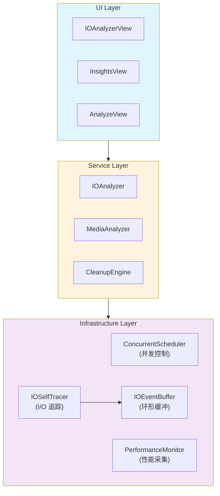
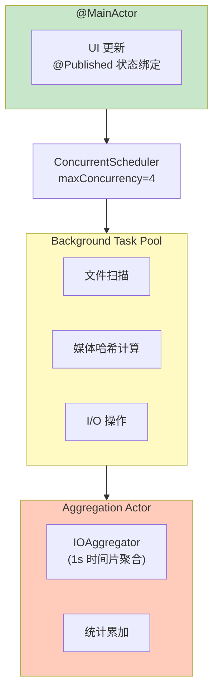

# SwiftSweep 并发与性能基础设施设计文档

**项目名称**：SwiftSweep - 并发调度与性能监控基础设施  
**作者 / 时间**：2026-01-01  
**项目类型**：客户端基础设施 / 性能优化 / 工程能力展示  
**适用平台**：macOS（核心逻辑可迁移至 iOS）

---

## 1. 背景（Background）

在 macOS 系统清理与分析场景下，现有实现存在以下问题：

1. **并发失控**：扫描大量文件时，无限制创建 Task 导致系统资源耗尽，UI 卡顿明显
2. **性能黑盒**：无法实时观测 I/O 吞吐量、任务耗时，难以定位瓶颈
3. **资源竞争**：多模块并发访问共享状态时出现数据竞争，Swift 6 严格并发检查报错

这些问题在以下场景尤为明显：
- 扫描 10 万+ 文件的目录
- 同时运行媒体分析 + 磁盘扫描
- 后台长时间运行清理任务

---

## 2. 目标与非目标（Goals & Non-Goals）

### Goals
1. **可控并发**：限制最大并发任务数，避免系统资源耗尽
2. **可观测性**：实时监控 I/O 吞吐量、任务执行耗时
3. **Swift 6 兼容**：通过 `Sendable`、`actor` 消除数据竞争
4. **协作式取消**：支持任务取消传播，避免无效计算

### Non-Goals
- 不做系统级全局进程监控（需 root 权限）
- 不保证全量历史性能数据持久化（仅保留最近采样）
- 不实现分布式调度（单机场景）

---

## 3. 需求与约束（Requirements & Constraints）

### 功能需求
| 需求 | 描述 |
|------|------|
| 并发调度 | 限制并发任务数，支持优先级队列 |
| I/O 追踪 | 记录读写字节数、延迟、热点路径 |
| 性能采样 | 低开销采样，不影响主业务 |

### 非功能需求
| 类别 | 要求 |
|------|------|
| 性能 | 采样开销 < 1% CPU |
| 稳定性 | 不因监控导致崩溃 |
| 安全 | 敏感路径脱敏 |
| 可维护 | 模块解耦，易于测试 |

### 约束条件
- **平台限制**：App Sandbox，无法使用 `fs_usage`
- **权限限制**：仅追踪本进程 I/O
- **Swift 版本**：Swift 6 严格并发模式

---

## 4. 方案调研与对比（Alternatives Considered）

### 并发调度方案

| 方案 | 优点 | 缺点 | 结论 |
|------|------|------|------|
| GCD `DispatchQueue` | 熟悉、成熟 | 与 async/await 混用复杂 | ❌ |
| `OperationQueue` | 支持依赖、取消 | 较重，不适合轻量任务 | ❌ |
| **自定义 `ConcurrentScheduler`** | 轻量、可控、原生 async | 需自行实现背压 | ✅ |

### I/O 追踪方案

| 方案 | 优点 | 缺点 | 结论 |
|------|------|------|------|
| `fs_usage` | 系统级全量 | 需 root，沙盒不可用 | ❌ |
| DTTrace | 强大 | 复杂，沙盒受限 | ❌ |
| **包装 FileManager** | 无权限需求 | 仅追踪本进程 | ✅ |

---

## 5. 整体架构设计（Design Overview）



### 模块职责

| 模块 | 职责 |
|------|------|
| `ConcurrentScheduler` | 控制并发任务数，支持背压 |
| `PerformanceMonitor` | 采集任务耗时、资源使用 |
| `IOSelfTracer` | 包装 FileManager，追踪 I/O |
| `IOEventBuffer` | 环形缓冲 + 采样，避免内存膨胀 |

---

## 6. 关键设计点（Key Design Decisions）

### 6.1 使用 `actor` 管理并发状态

```swift
public actor ConcurrentScheduler {
    private var runningCount = 0
    private let maxConcurrency: Int
}
```

**原因**：避免显式锁，Swift 6 原生支持，编译器保证线程安全  
**代价**：访问需要 `await`，调用方需 async 上下文  
**替代方案**：`NSLock` + 队列隔离 — 更复杂，易出错

### 6.2 环形缓冲 + 采样

**原因**：高频 I/O 事件（> 1000/s）会导致内存膨胀  
**设计**：固定缓冲区 + 概率采样（高频时自动降采样）  
**代价**：丢失部分低频事件细节

### 6.3 路径脱敏

**原因**：用户隐私保护，避免泄露完整路径  
**设计**：仅保留最后两级目录  
**代价**：定位问题时需额外上下文

---

## 7. 并发与线程模型（Concurrency Model）



### 取消策略
- 支持 `Task.checkCancellation()`
- `withTaskGroup` 内任务全部取消传播
- UI 层提供"取消"按钮，调用 `task.cancel()`

---

## 8. 性能与资源管理（Performance & Resource Management）

### 性能瓶颈
| 瓶颈 | 解决方案 |
|------|----------|
| 大目录扫描 | 并发限制 + 增量刷新 |
| 媒体哈希 | pHash 缓存 + SQLite |
| 高频 I/O | 环形缓冲 + 采样 |

### 监控指标
- 任务队列长度
- 执行耗时 P50/P99
- 内存使用峰值

### 资源限制
- 最大并发任务：4
- 缓冲区大小：10,000 事件
- 采样率：高频时自动降至 10%

---

## 9. 风险与权衡（Risks & Trade-offs）

| 风险 | 影响 | 缓解 |
|------|------|------|
| 采样丢失关键事件 | 定位困难 | 保留异常事件（超时/失败） |
| actor 开销 | 高并发时 await 排队 | 批量提交，减少调用次数 |
| 路径脱敏过度 | 调试困难 | 可选的 Debug 模式 |

---

## 10. 验证与效果（Validation）

### 测试策略
| 类型 | 工具 | 覆盖 |
|------|------|------|
| 单元测试 | XCTest | Scheduler、Buffer 逻辑 |
| 性能测试 | XCTest + measure | 10k 任务调度 |
| 压力测试 | Instruments | 内存/CPU 曲线 |

### 效果指标
- 扫描 10 万文件耗时 < 30s
- CPU 峰值 < 50%
- 内存增量 < 100MB

---

## 11. 可迁移性（macOS → iOS）

| 能力 | 通用性 | 适配点 |
|------|--------|--------|
| ConcurrentScheduler | ✅ 完全通用 | 无 |
| PerformanceMonitor | ✅ 完全通用 | 无 |
| IOSelfTracer | ⚠️ 部分 | iOS 路径不同 |
| UI 组件 | ❌ | 需重写 UIKit/SwiftUI |

**上手成本**：Core 层 < 1 人天，UI 层需重写

---

## 12. 后续规划（Future Work）

1. **背压机制增强**：任务溢出时自动降级
2. **分布式 Trace ID**：跨模块调用链追踪
3. **持久化性能日志**：导出 JSON 供离线分析

---

## 13. 总结（Takeaways）

本项目重点不在于功能堆砌，而在于**在真实约束下（App Sandbox、Swift 6 并发模型），对并发控制、性能监控和可维护性的工程权衡**。

核心价值：
- **可控**：ConcurrentScheduler 避免资源失控
- **可观测**：IOAnalyzer 提供实时 I/O 视图
- **可迁移**：基础设施与业务解耦，可复用于 iOS
