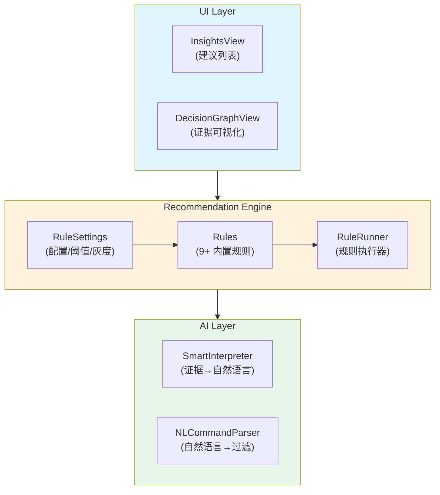
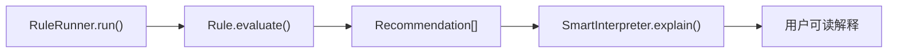
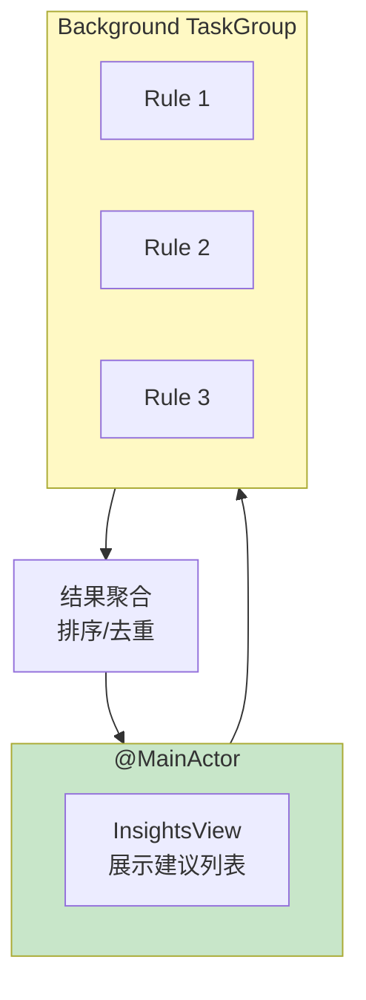

# SwiftSweep 智能建议引擎设计文档

**项目名称**：SwiftSweep - Smart Insights 规则引擎  
**作者 / 时间**：2026-01-01  
**项目类型**：规则引擎 / AI Coding / 工程能力展示  
**适用平台**：macOS（核心逻辑可迁移至 iOS）

---

## 1. 背景（Background）

在系统清理建议场景下，现有实现存在以下问题：

1. **规则硬编码**：清理策略散落在代码各处，难以维护和扩展
2. **缺乏解释**：用户不知道"为什么"推荐清理某些文件
3. **无优先级**：所有建议平等展示，用户难以决策
4. **无法定制**：不同用户有不同的清理偏好

这些问题在以下场景尤为明显：
- 需要快速添加新的清理规则
- 面试时需要展示"可解释 AI"能力
- 企业场景需要灰度发布新规则

---

## 2. 目标与非目标（Goals & Non-Goals）

### Goals
1. **规则解耦**：每条规则独立实现，遵循单一职责
2. **证据驱动**：每条建议附带结构化证据（Evidence）
3. **可解释**：通过 SmartInterpreter 生成自然语言解释
4. **可配置**：支持开关、阈值、优先级、灰度

### Non-Goals
- 不做机器学习自动生成规则（过复杂）
- 不支持用户自定义脚本规则
- 不做实时监控触发

---

## 3. 需求与约束（Requirements & Constraints）

### 功能需求
| 需求 | 描述 |
|------|------|
| 规则执行 | 批量运行规则，收集建议 |
| 优先级排序 | 按严重程度、可回收空间排序 |
| 阈值配置 | 用户可调整规则阈值 |
| 灰度控制 | 新规则可标记为 Beta |

### 非功能需求
| 类别 | 要求 |
|------|------|
| 扩展性 | 添加规则仅需新建文件 |
| 性能 | 规则执行 < 5s |
| 可测试 | 规则可独立单元测试 |

### 约束条件
- **沙盒**：规则只能访问授权目录
- **无网络**：规则本地执行
- **Swift 6**：规则需 Sendable

---

## 4. 方案调研与对比（Alternatives Considered）

### 规则系统架构

| 方案 | 优点 | 缺点 | 结论 |
|------|------|------|------|
| if-else 硬编码 | 简单 | 不可扩展 | ❌ |
| JSON/YAML 配置 | 数据驱动 | 表达能力弱 | ❌ |
| **协议 + 注册表** | 类型安全、可扩展 | 需编译 | ✅ |

### 证据模型

| 方案 | 优点 | 缺点 | 结论 |
|------|------|------|------|
| 字符串描述 | 简单 | 不可结构化 | ❌ |
| **类型化 Evidence** | 可解析、可序列化 | 需定义类型 | ✅ |

---

## 5. 整体架构设计（Design Overview）



### 数据流



### 内置规则

| 规则 ID | 名称 | 类别 |
|---------|------|------|
| `low_disk_space` | 低磁盘空间 | Storage |
| `old_downloads` | 旧下载文件 | Storage |
| `developer_caches` | 开发者缓存 | Storage |
| `large_caches` | 大型应用缓存 | Storage |
| `browser_cache` | 浏览器缓存 | Privacy |
| `screenshot_cleanup` | 桌面截图 | Storage |
| `trash_reminder` | 废纸篓提醒 | Storage |
| `mail_attachments` | 邮件附件 | Privacy |
| `unused_apps` | 未使用应用 | Performance |

---

## 6. 关键设计点（Key Design Decisions）

### 6.1 规则协议

```swift
public protocol RecommendationRule: Sendable {
    var id: String { get }
    var category: RuleCategory { get }
    
    func evaluate(context: RecommendationContext) async throws -> [Recommendation]
}
```

**原因**：类型安全，编译器检查  
**代价**：新规则需编译

### 6.2 结构化证据

```swift
public struct Evidence: Sendable, Codable {
    public let kind: EvidenceKind  // .path, .metric, .metadata, .aggregate
    public let label: String
    public let value: String
}
```

**原因**：支持 SmartInterpreter 解析，支持 UI 渲染  
**代价**：需定义证据类型

### 6.3 配置持久化

```swift
public final class RuleSettings {
    func isRuleEnabled(_ ruleID: String) -> Bool
    func threshold(forRule ruleID: String, key: String) -> Int
    func priority(forRule ruleID: String) -> Int
    func isGrayRelease(forRule ruleID: String) -> Bool
}
```

**原因**：支持用户定制，支持灰度发布  
**代价**：需 UI 配置页面

---

## 7. 并发与线程模型（Concurrency Model）



### 并发策略
- 规则并行执行（`withTaskGroup`）
- 结果在 MainActor 聚合
- 单规则内部可自行并发

---

## 8. 性能与资源管理（Performance & Resource Management）

| 优化 | 策略 |
|------|------|
| 规则缓存 | 短时间内不重复扫描 |
| 早退出 | 达到阈值立即返回 |
| 惰性计算 | 文件大小按需计算 |

### 实测数据

| 场景 | 规则数 | 耗时 |
|------|--------|------|
| 冷启动 | 9 | < 3s |
| 热启动 | 9 | < 1s |

---

## 9. 风险与权衡（Risks & Trade-offs）

| 风险 | 影响 | 缓解 |
|------|------|------|
| 规则误报 | 用户困扰 | 可关闭规则 |
| 规则冲突 | 重复建议 | 去重策略 |
| 配置丢失 | 重置到默认 | UserDefaults 持久化 |

---

## 10. 验证与效果（Validation）

| 测试 | 方法 |
|------|------|
| 规则正确性 | 单元测试 + 快照测试 |
| 配置持久化 | UserDefaults 读写测试 |
| 解释质量 | 人工 Review |

---

## 11. 可迁移性（macOS → iOS）

| 组件 | 通用性 | 适配点 |
|------|--------|--------|
| RecommendationRule | ✅ | 无 |
| Evidence | ✅ | 无 |
| SmartInterpreter | ✅ | 无 |
| 具体规则 | ⚠️ | 路径不同 |

---

## 12. 后续规划（Future Work）

1. **规则依赖**：规则间可声明依赖关系
2. **规则商店**：展示可选规则包
3. **AI 规则生成**：基于用户行为生成规则

---

## 13. 总结（Takeaways）

本项目展示了**使用协议扩展点设计可扩展规则引擎**的能力。

核心价值：
- **可扩展**：协议 + 注册表模式
- **可解释**：结构化证据 + 自然语言
- **可配置**：阈值、优先级、灰度
