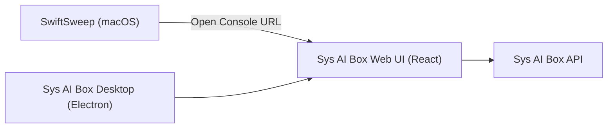

# Integration Design: SwiftSweep + Sys AI Box / 集成设计

## 1. Overview / 概览

This document outlines the architectural design for integrating **SwiftSweep** (macOS Client) with **Sys AI Box** (AI/Server Orchestrator).
中文：本文档描述 SwiftSweep（macOS 客户端）与 Sys AI Box（AI/服务器编排平台）的集成架构设计。

The goal is to extend SwiftSweep's capabilities to support:
中文：目标是扩展 SwiftSweep 的能力，支持：
1.  **Remote Server Management**: Cleaning and monitoring remote Linux/macOS servers.  
    中文：远程服务器管理：清理与监控远程 Linux/macOS 服务器。
2.  **Container Support**: Managing Docker containers (prune, stats) on remote hosts.  
    中文：容器支持：在远程主机上管理 Docker 容器（清理、统计）。
3.  **AI Intelligence**: Utilizing Sys AI Box's LLM capabilities for smarter analysis.  
    中文：AI 智能：利用 Sys AI Box 的 LLM 能力进行更智能的分析。

### Scope and Non-Goals / 范围与非目标

* **In scope**: remote inventory, stats, and action triggering via Sys AI Box; container lifecycle and cleanup operations on remote hosts; optional AI-assisted analysis as an opt-in feature.  
  中文：范围内：通过 Sys AI Box 获取远程清单、统计与动作触发；远程主机容器生命周期与清理操作；可选的 AI 辅助分析能力。
* **Out of scope**: direct SSH execution from SwiftSweep, remote filesystem browsing, and local privileged execution for remote targets. All remote actions are executed by Sys AI Box.  
  中文：范围外：SwiftSweep 直接执行 SSH、远程文件系统浏览、本地特权执行远程目标操作。所有远程动作由 Sys AI Box 执行。

## 2. Architecture / 架构

We leverage the **Plugin Architecture** defined in `DESIGN_PLUGIN.md` and adopt the Independent Web UI strategy.
中文：采用 `DESIGN_PLUGIN.md` 中的插件架构，并以独立 Web UI 为主要交互界面。

```mermaid
graph TD
    subgraph "SwiftSweep (Client)"
        UI[SwiftSweepUI]
        Core[SwiftSweepCore]
        Plugin[SysAIBoxPlugin]
        Auth[DeviceAuthManager]
    end

    subgraph "Sys AI Box (Server)"
        API[API Gateway]
        WebUI[Web UI (/console)]
        LLM[LLM Orchestrator]
        Monitor[Server Monitor]
        Docker[Container Manager]
    end

    UI --> Core
    Core --> Plugin
    Plugin -- Health/Auth --> API
    UI -- Open Console --> WebUI
    WebUI --> API
    API --> LLM
    API --> Monitor
    API --> Docker
```

## 3. Proposed Solutions / 方案

We propose three levels of integration, ranging from a thin attachment layer to AI-assisted workflows.
中文：提供三层集成方案，从轻量挂接到 AI 协同。

### Option A: Independent Web UI Plugin (Recommended Start) / 独立 Web UI 插件（推荐起步）

Implement `SysAIBoxPlugin` as a thin attachment layer for Web UI usage.
中文：以 `SysAIBoxPlugin` 作为轻量挂接层，主 UI 由 Web 控制台承担。

* **Features / 功能**:
  * **Connection Settings + Health Check**: Configure baseURL and validate connectivity.  
    中文：连接配置与健康检查：设置 baseURL 并验证连通性。
  * **Device Pairing**: Device-code flow for secure pairing.  
    中文：设备码配对：使用设备码流程进行安全绑定。
  * **Open Console**: Launch `{baseURL}/console` in browser (or optional WebView later).  
    中文：打开控制台：在浏览器打开 `{baseURL}/console`（或后续可选 WebView）。
  * **No Native Server/Container Views in v1**: Management UI lives in the Web console.  
    中文：v1 不提供原生服务器/容器界面，管理操作在 Web 控制台完成。
* **Implementation / 实现**:
  * `SysAIBoxPlugin` registers at app init (Plugin architecture).  
    中文：`SysAIBoxPlugin` 在应用启动时注册（插件架构）。
  * `SysAIBoxConfigStore` for baseURL with HTTPS validation.  
    中文：`SysAIBoxConfigStore` 保存 baseURL，并强制 HTTPS（localhost 例外）。
  * `SysAIBoxHealthChecker` calls `GET /api/v1/health`.  
    中文：`SysAIBoxHealthChecker` 调用 `GET /api/v1/health`。
  * `DeviceAuthManager` + `TokenManager` manage device-code flow and tokens in Keychain.  
    中文：`DeviceAuthManager` + `TokenManager` 管理设备码流程与 Keychain token。
  * Settings entry appears in **Settings → Plugins** via `PluginSettingsView`.  
    中文：设置入口在 **Settings → Plugins**，通过 `PluginSettingsView` 展示。

### Option B: Intelligent Advisor (Optional) / 智能顾问（可选）

Use Sys AI Box as the "Brain" for analysis and recommendations.
中文：让 Sys AI Box 提供分析与建议能力。

* **Features / 功能**:
  * **Log Analysis**: Send anonymized system logs for anomaly detection.  
    中文：日志分析：匿名化日志上送进行异常检测。
  * **Smarter Rules**: Dynamic rules based on trends (e.g., Xcode caches).  
    中文：动态规则：基于趋势生成清理建议。
  * **NL Command Processing**: Offload complex NL parsing to LLM.  
    中文：自然语言解析：复杂指令交给 LLM 处理。
  * **Privacy Controls**: Opt-in toggles and redaction policy.  
    中文：隐私控制：可选开关与脱敏策略。

### Option C: Agentic Control (Optional) / 自主代理控制（可选）

Allow Sys AI Box to run multi-step workflows with explicit user consent.
中文：在用户明确授权下执行多步自动化流程。

* **Features / 功能**:
  * Automated scheduled cleanup.  
    中文：自动化定期清理。
  * "Fix my server" multi-step workflow.  
    中文：“一键修复服务器”多步骤流程。
  * Policy gating for destructive actions.  
    中文：对破坏性动作进行策略管控。

## 4. Technical Design (Option A) / 技术设计（Option A）

We proceed with **Option A** as the foundation; native SwiftUI views are deferred.
中文：优先落地 **Option A**，原生 SwiftUI 视图暂缓实现。

### 4.1 Plugin Definition / 插件定义

```swift
public struct SysAIBoxPlugin: SweepPlugin {
    public let id = "com.swiftsweep.sysaibox"
    public let name = "Sys AI Box"
    public let description = "Thin attachment layer for Sys AI Box Web UI"
    public let version = "0.1.0"
    public let minAppVersion = "1.0.0"

    public init() {}

    public func analyze(context: PluginContext) async throws -> [Recommendation] {
        // v1: analysis is handled by Web UI; no local recommendations.
        return []
    }
}
```

**Attachment Components / 挂接组件**
* **SysAIBoxConfigStore**: Stores `baseURL` in UserDefaults; enforces HTTPS (localhost/127.0.0.1 allowed).  
  中文：保存 baseURL（UserDefaults），强制 HTTPS（localhost/127.0.0.1 例外）。
* **SysAIBoxHealthChecker**: `GET /api/v1/health` for "Test Connection".  
  中文：用于“测试连接”的健康检查。
* **DeviceAuthManager**: Device-code flow for pairing; handles polling and token exchange.  
  中文：设备码配对流程，负责轮询与 token 交换。
* **TokenManager**: Access/refresh token lifecycle in Keychain.  
  中文：Keychain 中管理 access/refresh token 生命周期。
* **SysAIBoxWebView (optional)**: Embedded Web UI with strict security constraints.  
  中文：可选 WebView 嵌入，带严格安全限制。

**Remote Actions (Deferred) / 远程动作（暂缓）**
* SwiftSweep v1 does not execute remote actions locally; all actions are performed in the Web UI.  
  中文：v1 不在 SwiftSweep 本地触发远程动作，所有动作由 Web UI 执行。
* A `RemoteActionExecutor` can be introduced later if native actions are required.  
  中文：如需原生动作，后续可引入 `RemoteActionExecutor`。

### 4.2 Data Models & API Contract / 数据模型与 API 合约

These models are primarily used by Sys AI Box and its Web UI. SwiftSweep v1 does not render them natively.
中文：这些模型主要供 Sys AI Box 与 Web UI 使用，SwiftSweep v1 不提供原生渲染。

#### JSON Schemas / JSON 结构

**RemoteServer** — Server inventory record.  
中文：远程服务器清单记录。
```json
{
  "id": "srv-123",
  "name": "Production-01",
  "os": "ubuntu-22.04",
  "status": "online", // online, offline, maintenance
  "tags": ["prod", "db"],
  "last_updated": "2023-10-27T10:00:00Z",
  "metrics": {
    "cpu_usage": 45.2,
    "memory_usage": 60.1,
    "disk_usage": 80.5
  }
}
```

**ContainerInfo** — Container summary on a server.  
中文：服务器上的容器概要信息。
```json
{
  "id": "cnt-456",
  "name": "redis-cache",
  "image": "redis:7",
  "state": "running", // running, exited, paused
  "uptime": "2 weeks",
  "server_id": "srv-123"
}
```

**ActionJob** — Async action execution state.  
中文：异步动作执行状态。
```json
{
  "job_id": "job-789",
  "type": "docker_prune",
  "status": "running", // pending, running, completed, failed, cancelled
  "progress": 45,
  "result": null,
  "error": null,
  "created_at": "2023-10-27T10:05:00Z"
}
```

**Capability** — Action capability metadata.  
中文：动作能力描述。
```json
{
  "key": "clean_apt_cache",
  "name": "Clean APT Cache",
  "description": "Removes var/cache/apt",
  "risk_level": "medium", // low, medium, high, critical
  "requires_confirmation": true
}
```

#### Endpoints / 接口

**Health & Discovery (Anonymous) / 健康检查与发现（匿名）**
* `GET /api/v1/health`: Health check for "Test Connection".  
  中文：用于“测试连接”的健康检查。
* `GET /api/v1/version`: API version info for compatibility.  
  中文：API 版本信息，用于兼容性判断。

**Server & Container Management (Authenticated) / 服务器与容器管理（需认证）**
* `GET /api/v1/servers`: List managed servers.  
  中文：获取服务器列表。
* `GET /api/v1/servers/{id}/stats`: Get real-time stats.  
  中文：获取实时统计。
* `GET /api/v1/servers/{id}/containers`: List containers on a server.  
  中文：获取服务器容器列表。
* `GET /api/v1/servers/{id}/capabilities`: List supported actions by OS/role.  
  中文：获取可用动作能力。
* `POST /api/v1/actions`: Execute action and return job id.  
  中文：触发动作并返回任务 ID。
* `GET /api/v1/actions/{jobId}`: Poll job status/progress.  
  中文：查询任务状态/进度。
* `POST /api/v1/actions/{jobId}/cancel`: Cancel a running job.  
  中文：取消执行中的任务。
* `POST /api/v1/ai/analyze`: Optional AI analysis endpoint.  
  中文：可选 AI 分析接口。

**Device-Code Auth Flow / 设备码授权流程**
* `POST /api/v1/auth/device/start`: Returns device/user code and verification URI.  
  中文：返回设备码/用户码与验证地址。
* `GET /api/v1/auth/device/status?device_code={code}`: Poll status (pending/authorized/expired).  
  中文：轮询状态（待授权/已授权/已过期）。
* `POST /api/v1/auth/device/token`: Exchange device code for tokens.  
  中文：用设备码交换 token。
* `POST /api/v1/auth/refresh`: Refresh access token.  
  中文：刷新 access token。
* `POST /api/v1/auth/revoke`: Revoke current device session.  
  中文：撤销当前设备会话。

**Auth and Versioning / 认证与版本控制**
* `Authorization: Bearer <token>` for authenticated requests.  
  中文：认证请求使用 Bearer token。
* `X-Client-Version` and `X-Request-ID` headers for compatibility and tracing.  
  中文：客户端版本与请求追踪头。
* Versioned APIs (`/api/v1`) with semantic response versions in payloads.  
  中文：API 版本化与响应版本语义。

**Response Conventions / 响应规范**
* Success returns `data` + `request_id`.  
  中文：成功返回 `data` 与 `request_id`。
* Errors return `code`, `message`, `request_id`, and `retry_after` where applicable.  
  中文：错误返回 `code`/`message`/`request_id`/`retry_after`。

### 4.3 UI Integration / UI 集成

* **Settings Entry (v1)**: Added under **Settings → Plugins** via `PluginSettingsView`.  
  中文：v1 在 **Settings → Plugins** 中通过 `PluginSettingsView` 展示。
* **Sys AI Box Row**: URL field, "Test Connection", "Pair Device", and "Open Console".  
  中文：提供 URL、测试连接、配对、打开控制台入口。
* **No Native Server/Container Views**: Native SwiftUI views deferred.  
  中文：不提供原生服务器/容器视图，后续再考虑。
* **Optional WebView (Phase 4)**: Embed Web UI with strict security constraints.  
  中文：可选 WebView 嵌入（第 4 阶段）。

### 4.4 Execution Flow (v1) / 执行流程（v1）

1. User enables plugin and sets `baseURL`.  
   中文：启用插件并设置 `baseURL`。
2. "Test Connection" calls `GET /api/v1/health`.  
   中文：点击测试连接调用健康检查。
3. Pair device via device-code flow and store tokens in Keychain.  
   中文：设备码配对并将 token 存入 Keychain。
4. "Open Console" launches `{baseURL}/console` (browser or WebView).  
   中文：打开 `{baseURL}/console`（浏览器或 WebView）。
5. Token refresh/revoke handled by `TokenManager`.  
   中文：`TokenManager` 负责刷新/撤销会话。

### 4.5 Security and Permissions / 安全与权限

**Authentication Lifecycle / 认证生命周期**
* **Device-Code Flow**: Primary auth method.  
  中文：设备码为主要授权方式。
* **Token Types**:
  * `access_token`: Short-lived (e.g., 15 min).  
    中文：短期 token（如 15 分钟）。
  * `refresh_token`: Longer-lived (e.g., 7 days).  
    中文：长期 token（如 7 天）。
* **No Long-Lived API Keys**: SwiftSweep does NOT store static API keys.  
  中文：不存储长期 API key。
* **Session Recovery**:
  * On `401 Unauthorized`: Attempt token refresh.  
    中文：遇到 401 自动刷新。
  * On refresh failure: Prompt user to re-pair device.  
    中文：刷新失败提示重新配对。
* **Revocation**: User can revoke via Web UI or `POST /api/v1/auth/revoke`.  
  中文：支持在 Web UI 或接口撤销。

**Token Storage / Token 存储**
* `access_token` and `refresh_token` stored in **Keychain**.  
  中文：token 存在 Keychain。
* `baseURL` stored in **UserDefaults**.  
  中文：baseURL 存在 UserDefaults。

**Network Security / 网络安全**
* **HTTPS Required**: Reject `http://` unless host is `127.0.0.1` or `localhost`.  
  中文：除本地外必须 HTTPS。
* `X-Client-Version` and `X-Request-ID` for compatibility and tracing.  
  中文：用于兼容性与追踪。

**RBAC & Audit / 权限与审计**
* Sys AI Box enforces RBAC and action-level permissions.  
  中文：Sys AI Box 负责 RBAC 与动作级权限。
* Destructive actions require explicit confirmation and audit logging.  
  中文：破坏性动作需确认并记录审计日志。

### 4.6 Data Privacy and AI Usage / 数据隐私与 AI 使用

* All AI features are opt-in and off by default.  
  中文：AI 功能默认关闭并需显式开启。
* Redact or hash sensitive file paths and identifiers before sending.  
  中文：敏感路径/标识符需要脱敏或哈希。
* Document data retention policies and allow users to delete remote logs.  
  中文：明确数据保留策略并允许删除日志。

### 4.7 Failure Modes and Observability / 故障与可观测性

* **Offline Handling**: Cache server list and capabilities with TTL; show "Last updated".  
  中文：离线时使用缓存并显示更新时间。
* **Timeout & Retry**: Exponential backoff for network calls.  
  中文：网络请求指数退避重试。
* **Tracing**: Correlate client/server logs via `request_id`.  
  中文：通过 `request_id` 关联日志。

## 5. Implementation Plan / 实施计划

**User Review Required / 用户评审必需**  
This plan prioritizes the Independent Web UI strategy; native SwiftUI views are deferred.  
中文：该计划优先采用独立 Web UI，原生 SwiftUI 视图暂缓实现。

**Plugin vs Non-Plugin Strategy / 插件策略**
* Integration is implemented as a Plugin (`SysAIBoxPlugin`) following `DESIGN_PLUGIN.md`.  
  中文：按插件架构实现 `SysAIBoxPlugin`。
* Settings entry is added to **Settings → Plugins** via `PluginSettingsView` in `Sources/SwiftSweepUI/SettingsView.swift`.  
  中文：设置入口位于 `Sources/SwiftSweepUI/SettingsView.swift` 的 **Settings → Plugins**。

### Phase 0: Strategy Clarification / 策略澄清
* **Approach**: Use Plugin architecture; `SysAIBoxPlugin` registers at app init.  
  中文：采用插件架构，应用启动时注册。
* **Settings Entry**: Plugin settings appear in **Settings → Plugins** via `PluginSettingsView`.  
  中文：设置入口位于插件设置区。
* **Files**: No new UI entry point needed; plugin infrastructure handles discovery.  
  中文：无需新增 UI 入口，复用插件发现机制。

### Phase 1: Minimal Attachment Layer / 最小接入层
* **[NEW] SysAIBoxConfigStore.swift**  
  baseURL stored in UserDefaults; HTTPS required (localhost/127.0.0.1 allowed).  
  中文：保存 baseURL（UserDefaults），强制 HTTPS（本地例外）。
* **[NEW] SysAIBoxHealthChecker.swift**  
  `checkHealth(baseURL:)` calls `GET /api/v1/health`.  
  中文：调用健康检查用于“测试连接”。
* **[MODIFY] PluginSettingsView.swift**  
  Add "Sys AI Box" row with URL field, "Test Connection", "Open Console".  
  中文：新增 Sys AI Box 行：URL、测试连接、打开控制台。

### Phase 2: Device-Code Auth Flow / 设备码授权
* **[NEW] DeviceAuthManager.swift**  
  `startPairing()` → `POST /api/v1/auth/device/start`;  
  `pollStatus(deviceCode:)` → `GET /api/v1/auth/device/status`;  
  `exchangeForTokens(deviceCode:)` → `POST /api/v1/auth/device/token`;  
  store tokens in Keychain.  
  中文：实现设备码流程与 Keychain 存储。
* **[MODIFY] Plugin Settings UI**  
  Add "Pair Device" button; show `user_code` and instructions; poll until paired.  
  中文：新增配对按钮并展示用户码与提示。

### Phase 3: Session Management / 会话管理
* **[NEW] TokenManager.swift**  
  `getAccessToken()` (auto-refresh), `refresh()`, `revoke()`.  
  中文：自动刷新、撤销会话。
* **[MODIFY] Plugin UI**  
  Show Connected/Disconnected state and "Last updated" when offline.  
  Add "Disconnect" to revoke session.  
  中文：显示连接状态与离线时间，并支持断开。

### Phase 4: Optional WKWebView Embed / 可选 WebView 嵌入
* **[NEW] SysAIBoxWebView.swift**  
  `WKWebsiteDataStore.nonPersistent()`, host whitelist, no JS bridge.  
  "Disconnect" clears data store and revokes session.  
  中文：非持久化存储 + 域名白名单 + 禁用 JS 桥。

### Future: Design Token Sync / 设计 Token 同步（未来）
* Export `tokens.json` and generate `SwiftSweepTokens.swift` for shared styling.  
  中文：导出 tokens 并生成 SwiftUI 主题。

### Verification Plan / 验证计划

**Manual Testing / 手动验证**
* **Settings**: Add URL → "Test Connection" → expect "Connected" toast.  
  中文：设置 URL 并测试连接，出现已连接提示。
* **Pair Device**: Start pairing → show `user_code` → confirm in Web UI → "Paired".  
  中文：设备码配对完成并显示已配对。
* **Open Console**: Click "Open Console" → browser opens `{baseURL}/console`.  
  中文：打开控制台进入 Web UI。
* **Offline**: Disconnect network → show "Offline" badge + stale timestamp.  
  中文：离线时显示离线标识与更新时间。
* **Embedded View** (Phase 4): Open WebView → navigation restricted to host.  
  中文：WebView 仅允许白名单域名。

## 6. Independent Web UI Strategy (React + Electron) / 独立 Web UI 策略

This strategy keeps the Sys AI Box UI outside SwiftSweep while preserving a consistent visual system.
中文：该策略使 Sys AI Box UI 独立于 SwiftSweep，同时保持一致的视觉规范。

### 6.1 Architecture / 架构



* **Single React UI** served by Sys AI Box (`/console`) and reused by Electron.  
  中文：同一套 React UI 由 Sys AI Box 提供并被 Electron 复用。
* **SwiftSweep integration** is minimal: settings, auth, and "Open Console".  
  中文：SwiftSweep 仅提供设置、认证与打开控制台。

### 6.2 SwiftSweep Attachment Model (macOS) / SwiftSweep 挂接方式

* **Default**: open the Web UI in the system browser with device-code or signed URL.  
  中文：默认在浏览器打开 Web UI。
* **Optional**: embed Web UI via `WKWebView` (Phase 4).  
  中文：可选 WebView 嵌入。

### 6.3 Auth and Session / 认证与会话

* **Device-code flow** for pairing; tokens stored in Keychain.  
  中文：设备码配对 + Keychain 存储。
* **Signed URL** (short TTL) for deep-linking if needed.  
  中文：可选短期签名 URL。

### 6.4 UI Consistency / UI 一致性

* **Design tokens** are the source of truth.  
  中文：设计 tokens 作为统一规范。
* Generate CSS variables for React and SwiftUI theme values for SwiftSweep.  
  中文：生成 CSS 变量与 SwiftUI 主题映射。

### 6.5 Deployment / 部署

* **LAN mode**: `http://box.local:8080/console`.  
  中文：局域网部署。
* **Cloud mode**: HTTPS with strict CORS and CSP.  
  中文：公网 HTTPS 严格安全策略。
* Electron shell loads the same Web UI URL.  
  中文：Electron 直接加载同一 URL。

### 6.6 Minimal API Additions / 最小接口补充

* `GET /api/v1/health`  
* `POST /api/v1/auth/device/start`  
* `GET /api/v1/auth/device/status`  
* `POST /api/v1/auth/device/token`  
* `POST /api/v1/auth/refresh`  
* `POST /api/v1/auth/revoke`

## 7. Questions for Discussion / 讨论问题

1.  Does Sys AI Box currently expose a REST API? Do we have an OpenAPI spec?  
    中文：Sys AI Box 是否已有 REST API？是否有 OpenAPI 规范？
2.  Should integration be LAN-only or Internet-facing (stronger auth required)?  
    中文：集成是否仅限局域网，还是公网访问？
3.  Are containers a top-level concept or always scoped under a server?  
    中文：容器应作为一级概念还是归属于服务器？
4.  What OS mix should be supported first, and which actions map to each OS?  
    中文：优先支持哪些 OS？动作如何映射？
5.  Do we need WebSocket/SSE for live stats, or is polling sufficient for v1?  
    中文：实时统计需要 WebSocket/SSE 吗？
6.  What audit log retention and export format are required for enterprise users?  
    中文：企业用户需要怎样的审计日志保留与导出格式？
