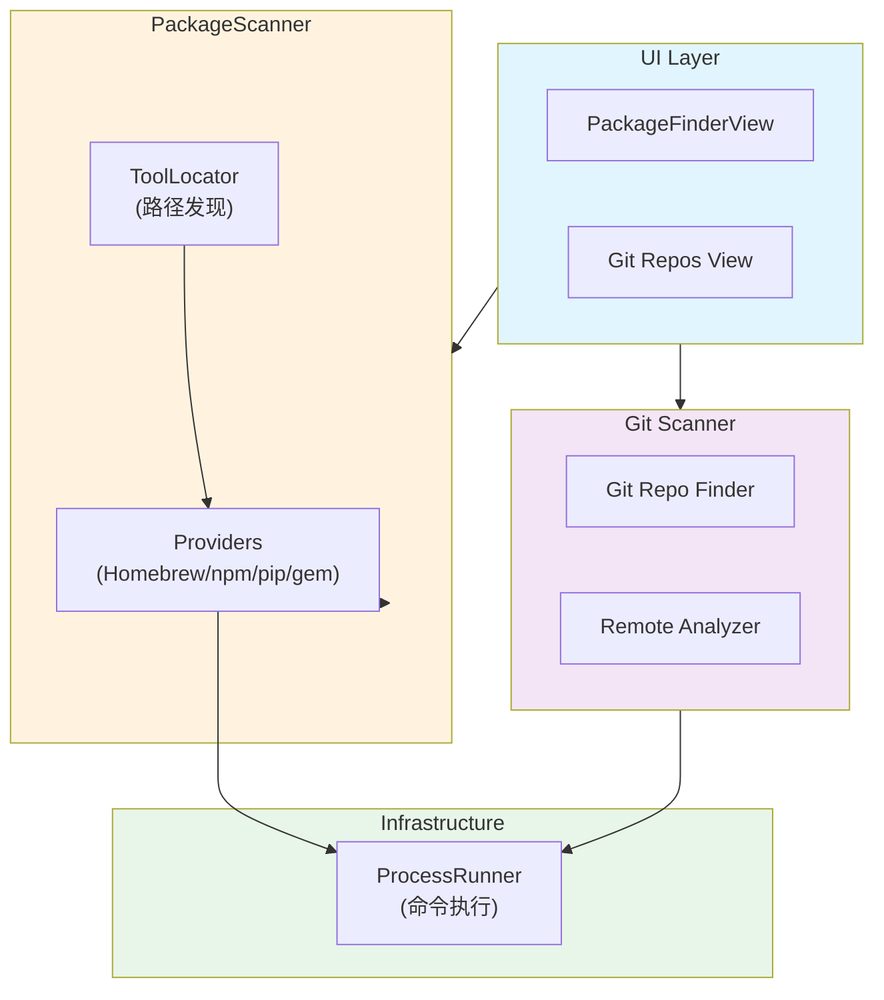
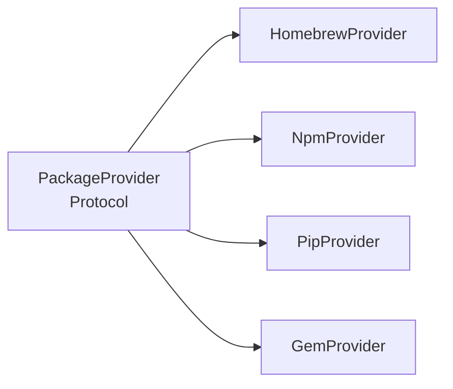
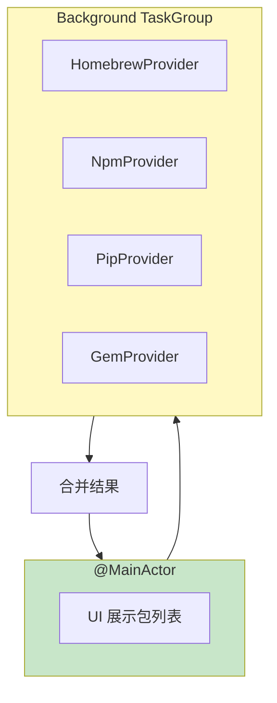

# SwiftSweep 包管理与依赖分析设计文档

**项目名称**：SwiftSweep - 多生态包扫描与 Git 仓库管理  
**作者 / 时间**：2026-01-01  
**项目类型**：系统工具 / 开发者效率 / 工程能力展示  
**适用平台**：macOS

---

## 1. 背景（Background）

在开发者环境管理场景下，现有实现存在以下问题：

1. **包散落各处**：Homebrew、npm、pip、gem 各自独立管理
2. **孤儿包累积**：不再需要的依赖占用大量空间
3. **Git .git 体积膨胀**：历史对象、未清理的 remote 占用空间
4. **无全局视图**：缺乏统一入口管理所有包

这些问题在以下场景尤为明显：
- 开发者频繁切换项目
- 长期运行的开发机
- 需要清理空间但不清楚哪些可删

---

## 2. 目标与非目标（Goals & Non-Goals）

### Goals
1. **统一视图**：单一界面展示所有包管理器的包
2. **孤儿检测**：识别无依赖的顶层包
3. **Git 维护**：一键 gc、prune、清理 remote
4. **安全执行**：所有操作可预览、可取消

### Non-Goals
- 不替代原生包管理器
- 不支持 Windows/Linux 包管理器
- 不做版本升级管理（仅展示）

---

## 3. 需求与约束（Requirements & Constraints）

### 功能需求
| 需求 | 描述 |
|------|------|
| 包扫描 | 发现 Homebrew/npm/pip/gem 已安装包 |
| 孤儿检测 | 识别孤儿包（无被依赖） |
| Git 扫描 | 发现本地 Git 仓库 |
| 批量操作 | 卸载包、git gc、git remote prune |

### 非功能需求
| 类别 | 要求 |
|------|------|
| 性能 | 扫描 < 10s |
| 安全 | 不执行未知命令 |
| 可恢复 | 卸载仅标记，用户可手动恢复 |

### 约束条件
- **沙盒限制**：需通过 ProcessRunner 调用外部命令
- **路径依赖**：不同用户可能安装在不同路径
- **无 root**：仅操作用户态包

---

## 4. 方案调研与对比（Alternatives Considered）

### 包发现方案

| 方案 | 优点 | 缺点 | 结论 |
|------|------|------|------|
| 解析配置文件 | 快速 | 不同版本格式不同 | ❌ |
| **调用 CLI 命令** | 准确、官方支持 | 需 spawn 进程 | ✅ |

### 命令执行方案

| 方案 | 优点 | 缺点 | 结论 |
|------|------|------|------|
| Process.run | 简单 | 阻塞 | ❌ |
| **ProcessRunner + Pipe** | 非阻塞、有超时 | 复杂 | ✅ |

---

## 5. 整体架构设计（Design Overview）



### Provider 架构



---

## 6. 关键设计点（Key Design Decisions）

### 6.1 Provider 协议

```swift
public protocol PackageProvider: Sendable {
    var name: String { get }
    var icon: String { get }
    
    func isAvailable() async -> Bool
    func listPackages() async throws -> [Package]
    func uninstall(_ package: Package) async throws
}
```

**原因**：统一接口，便于扩展  
**代价**：需为每个包管理器实现

### 6.2 工具路径发现

```swift
struct ToolLocator {
    static func find(_ name: String) -> URL? {
        let paths = [
            "/opt/homebrew/bin/\(name)",
            "/usr/local/bin/\(name)",
            "~/.local/bin/\(name)"
        ]
        return paths.first { FileManager.default.fileExists(atPath: $0) }
    }
}
```

**原因**：不同 Mac 架构路径不同（Intel vs Apple Silicon）  
**代价**：需维护路径列表

### 6.3 孤儿检测

```swift
func findOrphans(packages: [Package]) -> [Package] {
    let dependedOn = Set(packages.flatMap { $0.dependents })
    return packages.filter { !dependedOn.contains($0.name) && $0.isExplicit }
}
```

**原因**：识别可安全删除的包  
**代价**：依赖信息不完整时可能误判

---

## 7. 并发与线程模型（Concurrency Model）



### 并发策略
- 四个 Provider 并行扫描
- CLI 调用有 30s 超时
- 结果在 MainActor 合并

---

## 8. 性能与资源管理（Performance & Resource Management）

| 优化 | 策略 |
|------|------|
| 缓存 | 扫描结果短期缓存 |
| 超时 | CLI 调用 30s 超时 |
| 分页 | 大量包分页展示 |

### 实测数据

| 场景 | 包数量 | 扫描耗时 |
|------|--------|----------|
| 轻量开发机 | ~100 | 2s |
| 重度开发机 | ~500 | 8s |

---

## 9. 风险与权衡（Risks & Trade-offs）

| 风险 | 影响 | 缓解 |
|------|------|------|
| CLI 不存在 | 扫描失败 | isAvailable 检查 |
| 卸载失败 | 状态不一致 | 重试 + 手动指引 |
| 权限不足 | 操作被拒 | 提示用户 |

---

## 10. 验证与效果（Validation）

| 测试 | 方法 |
|------|------|
| Provider 正确性 | Mock ProcessRunner |
| 孤儿算法 | 单元测试 |
| 超时处理 | 慢命令模拟 |

---

## 11. 可迁移性（macOS → iOS）

| 组件 | 通用性 |
|------|--------|
| PackageProvider 协议 | ✅ |
| 具体 Provider | ❌ macOS 专用 |
| ProcessRunner | ❌ macOS 专用 |

**结论**：此模块为 macOS 专属

---

## 12. 后续规划（Future Work）

1. **版本升级建议**：显示可升级包
2. **依赖图可视化**：Galaxy 风格展示
3. **批量导出/导入**：包列表备份

---

## 13. 总结（Takeaways）

本项目展示了**通过协议抽象统一多生态包管理器**的能力。

核心价值：
- **统一视图**：四大包管理器一站式管理
- **协议扩展**：新增 Provider 仅需实现协议
- **安全执行**：预览 + 确认 + 超时保护
