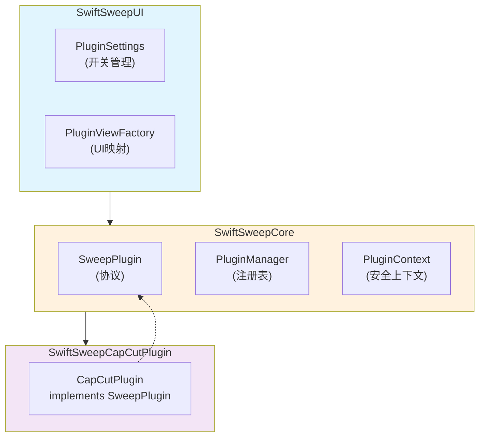
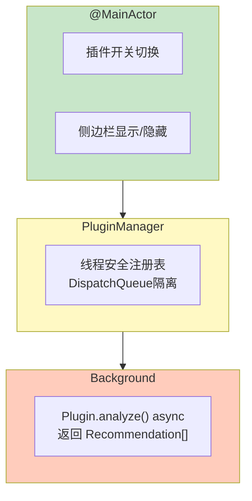

# SwiftSweep 插件架构设计文档

**项目名称**：SwiftSweep - 可扩展插件系统  
**作者 / 时间**：2026-01-01  
**项目类型**：系统设计 / 可扩展架构 / 工程能力展示  
**适用平台**：macOS（架构模式可迁移至 iOS / 跨平台）

---

## 1. 背景（Background）

在系统清理工具场景下，现有实现存在以下问题：

1. **功能耦合**：新增垂直场景（如 CapCut 清理）需修改主工程代码
2. **发布节奏受限**：垂直功能与核心功能绑定，无法独立迭代
3. **权限膨胀**：所有功能共享最高权限，安全风险增加

这些问题在以下场景尤为明显：
- 接入第三方应用清理规则
- 面向不同用户群体提供差异化能力
- 符合最小权限原则的安全设计

---

## 2. 目标与非目标（Goals & Non-Goals）

### Goals
1. **解耦**：垂直功能与核心功能分离，独立开发
2. **可发现**：自动发现并加载可用插件
3. **可控**：用户显式开关，默认禁用
4. **安全**：插件声明权限，沙盒隔离

### Non-Goals
- 不支持动态加载（避免 Hardened Runtime 问题）
- 不提供远程插件市场
- 不做插件间通信

---

## 3. 需求与约束（Requirements & Constraints）

### 功能需求
| 需求 | 描述 |
|------|------|
| 注册机制 | 编译时链接，运行时注册 |
| 开关控制 | UserDefaults 持久化开关状态 |
| UI 集成 | 启用后自动显示侧边栏入口 |

### 非功能需求
| 类别 | 要求 |
|------|------|
| 启动性能 | 禁用插件不加载代码 |
| 安全 | 插件无法访问未授权路径 |
| 可维护 | 插件独立 Target |

### 约束条件
- **代码签名**：Hardened Runtime 禁止 `disable-library-validation`
- **沙盒**：插件需通过用户选择获取文件访问权
- **Swift 6**：协议需支持 `Sendable`

---

## 4. 方案调研与对比（Alternatives Considered）

| 方案 | 优点 | 缺点 | 结论 |
|------|------|------|------|
| 动态 Bundle 加载 | 灵活 | 需禁用库验证，安全风险 | ❌ |
| 脚本引擎（Lua） | 极灵活 | 性能差，复杂度高 | ❌ |
| **编译时 Target** | 安全、Swift 原生 | 需重新编译 | ✅ |

**选择理由**：安全优先，符合 Apple 最佳实践

---

## 5. 整体架构设计（Design Overview）



### 模块职责

| 模块 | 层级 | 职责 |
|------|------|------|
| `SweepPlugin` | Core | 协议定义 |
| `PluginManager` | Core | 注册、开关、查询 |
| `PluginContext` | Core | 安全沙盒上下文 |
| `PluginSettings` | UI | 设置界面 |
| `PluginViewFactory` | UI | ID → View 映射 |
| `CapCutPlugin` | Plugin | 具体实现 |

---

## 6. 关键设计点（Key Design Decisions）

### 6.1 协议与 UI 解耦

```swift
// Core（无 SwiftUI 依赖）
public protocol SweepPlugin: Sendable {
    var id: String { get }
    var name: String { get }
    func analyze(context: PluginContext) async throws -> [Recommendation]
}

// UI（知道 SwiftUI）
struct PluginViewFactory {
    static func view(for pluginID: String) -> AnyView
}
```

**原因**：Core 不引入 UI 框架，保持可测试性  
**代价**：需要手动维护 ID → View 映射

### 6.2 注册时机

```swift
// SwiftSweepApp.init()
PluginManager.shared.register(CapCutPlugin())
```

**原因**：App 启动时立即注册，避免延迟初始化问题  
**替代方案**：懒加载 — 复杂度增加，收益不明显

### 6.3 安全上下文

```swift
public struct PluginContext {
    public let logger: Logger
    public let rootURL: URL  // 用户授权的目录
}
```

**原因**：插件不能直接访问任意路径，必须通过 `rootURL`  
**代价**：用户需手动选择目录

---

## 7. 并发与线程模型（Concurrency Model）



---

## 8. 性能与资源管理（Performance & Resource Management）

| 场景 | 开销 |
|------|------|
| 禁用插件 | 仅注册，不加载分析逻辑 |
| 启用但未使用 | 零开销（懒执行） |
| 执行分析 | 与普通功能相同 |

---

## 9. 风险与权衡（Risks & Trade-offs）

| 风险 | 影响 | 缓解 |
|------|------|------|
| 插件数量膨胀 | 设置页面复杂 | 分类展示 |
| ID 冲突 | 行为异常 | 使用反向域名 |
| 版本不兼容 | 崩溃 | minAppVersion 检查 |

---

## 10. 验证与效果（Validation）

| 测试 | 方法 |
|------|------|
| 注册/开关 | 单元测试 PluginManager |
| UI 集成 | 手动验证侧边栏 |
| 权限隔离 | 尝试访问未授权路径 |

---

## 11. 可迁移性（macOS → iOS）

| 组件 | 通用性 | 适配点 |
|------|--------|--------|
| SweepPlugin | ✅ 完全通用 | 无 |
| PluginManager | ✅ 完全通用 | 无 |
| PluginContext | ✅ 完全通用 | 路径调整 |
| UI | ❌ | 需 UIKit 重写 |

---

## 12. 后续规划（Future Work）

1. **权限声明**：插件显式声明需要的能力
2. **版本检查**：自动禁用不兼容插件
3. **插件商店**：展示可用插件列表（远期）

---

## 13. 总结（Takeaways）

本项目展示了**在 Apple 平台安全约束下，设计符合 OCP（开闭原则）的可扩展架构**的能力。

核心价值：
- **解耦**：垂直功能独立迭代
- **安全**：编译时链接，运行时权限控制
- **可扩展**：新增插件仅需实现协议
