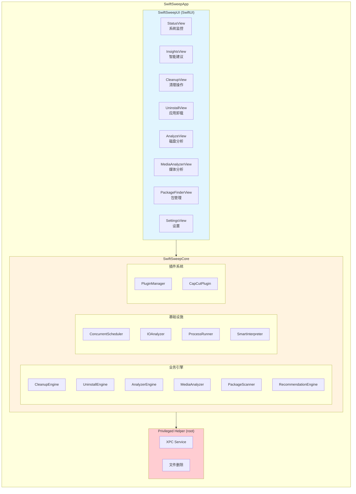
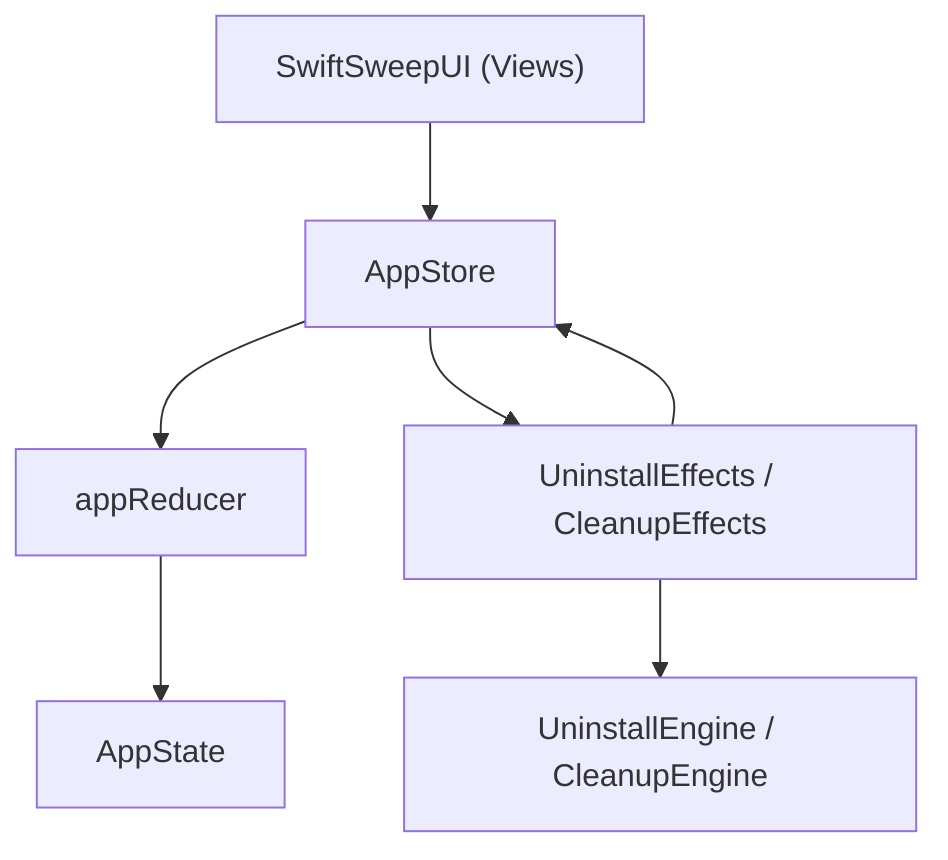
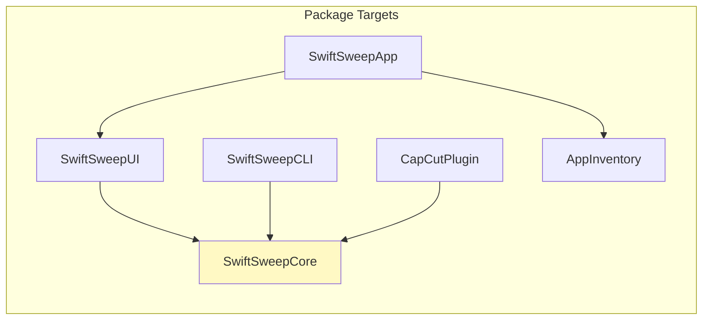
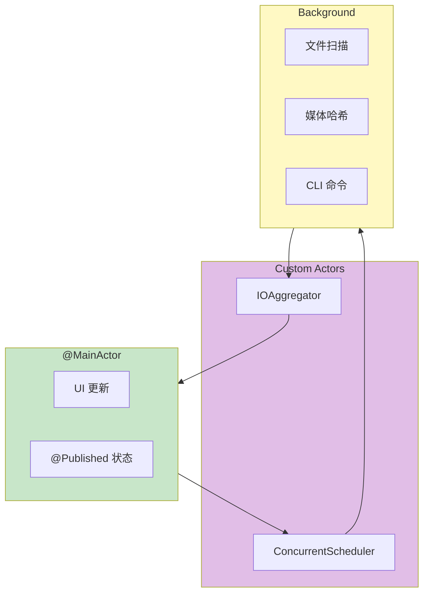

# SwiftSweep 系统架构总览

**项目名称**：SwiftSweep - macOS 系统清理与优化工具  
**作者 / 时间**：2026-01-01  
**项目类型**：系统工具 / 全栈工程 / 面试作品集  
**适用平台**：macOS 13+

---

## 1. 项目概述

SwiftSweep 是一款 macOS 原生系统清理工具，采用 Swift 6 + SwiftUI 构建，展示以下工程能力：

| 能力领域 | 核心模块 | 设计文档 |
|----------|----------|----------|
| 并发与性能 | IOAnalyzer, ConcurrentScheduler | [DESIGN_CONCURRENCY.md](DESIGN_CONCURRENCY.md) |
| 多媒体 AI | MediaAnalyzer, pHash, LSH | [DESIGN_MEDIA_ANALYZER.md](DESIGN_MEDIA_ANALYZER.md) |
| 可扩展架构 | Plugin System, CapCut MVP | [DESIGN_PLUGIN.md](DESIGN_PLUGIN.md) |
| 系统安全 | Uninstall Engine, PathValidator | [DESIGN_UNINSTALL.md](DESIGN_UNINSTALL.md) |
| 规则引擎 | Smart Insights, Evidence | [DESIGN_INSIGHTS.md](DESIGN_INSIGHTS.md) |
| 开发者工具 | PackageScanner, Git Manager | [DESIGN_PACKAGES.md](DESIGN_PACKAGES.md) |

---

## 2. 系统架构图



---

## 2.5 当前 UDF 分层（落地状态）

当前 UDF（单向数据流）已在 **卸载** 与 **清理** 功能落地，其它功能仍在迁移中。  
核心链路：UI → Store → Reducer → AppState → Effects → Engines → Action 回流。



**已落地模块（部分示例）**
- `AppState` / `AppAction` / `AppStore` / `Reducer` 已归入 `SwiftSweepCore/State`。
- `UninstallView` 与 `CleanView` 通过 `@EnvironmentObject AppStore` 派发 Action。
- `uninstallEffects` 与 `cleanupEffects` 作为副作用入口（清理扫描使用 `ConcurrentScheduler`）。

**仍在迁移**
- Insights / Status / Media / Packages 等页面仍使用局部状态或 `Task {}`。

---

## 3. 模块依赖关系



---

## 4. 技术栈

| 层级 | 技术 |
|------|------|
| UI | SwiftUI 5, Charts, NavigationSplitView |
| 业务逻辑 | Swift 6, async/await, actor |
| 数据持久化 | UserDefaults, SQLite (pHash Cache) |
| 进程间通信 | XPC, SMAppService |
| 外部命令 | ProcessRunner (Homebrew/npm/pip/gem/git) |

---

## 5. 并发模型总览



---

## 6. 安全架构

### 6.1 权限分层

| 层级 | 权限 | 职责 |
|------|------|------|
| App (沙盒) | 用户目录 | UI、业务逻辑 |
| Helper (root) | 全系统 | /Library 删除 |

### 6.2 安全措施

| 措施 | 实现 |
|------|------|
| 路径校验 | realpath + Allowlist |
| XPC 白名单 | 签名验证 |
| 最小权限 | 先尝试标准删除 |
| 审计日志 | 所有删除操作记录 |

---

## 7. 面试亮点索引

### 商业前端方向

| 亮点 | 文件 | 关键词 |
|------|------|--------|
| 虚拟化表格 | `DataGridView.swift` | NSTableView, 10k+ rows |
| 规则配置页 | `InsightsAdvancedConfigView.swift` | 拖拽, 灰度, A/B |
| Swift Charts | `ResultDashboardView.swift` | Line, Bar, Pie |

### AI Coding 方向

| 亮点 | 文件 | 关键词 |
|------|------|--------|
| 白盒 AI | `SmartInterpreter.swift` | 可解释性 |
| 决策树可视化 | `DecisionGraphView.swift` | 证据链 |
| NL 解析器 | `NLCommandParser.swift` | 中英双语 |
| pHash + LSH | `MediaAnalyzer.swift` | O(n) 相似检测 |

### 基础设施方向

| 亮点 | 文件 | 关键词 |
|------|------|--------|
| 并发调度 | `ConcurrentScheduler` | actor, 背压 |
| I/O 追踪 | `IOAnalyzer`, `IOSelfTracer` | 环形缓冲 |
| 安全删除 | `PathValidator`, `DeletionPlan` | 多层防护 |

---

## 8. 快速导航

| 我想了解... | 阅读文档 |
|-------------|----------|
| 系统整体架构 | 本文档 |
| 并发与性能设计 | [DESIGN_CONCURRENCY.md](DESIGN_CONCURRENCY.md) |
| 媒体相似检测 | [DESIGN_MEDIA_ANALYZER.md](DESIGN_MEDIA_ANALYZER.md) |
| 插件架构 | [DESIGN_PLUGIN.md](DESIGN_PLUGIN.md) |
| 安全删除机制 | [DESIGN_UNINSTALL.md](DESIGN_UNINSTALL.md) |
| 规则引擎 | [DESIGN_INSIGHTS.md](DESIGN_INSIGHTS.md) |
| 包管理 | [DESIGN_PACKAGES.md](DESIGN_PACKAGES.md) |
| 功能列表 | [README.md](../README.md) |
| 更新日志 | [CHANGELOG.md](../CHANGELOG.md) |

---

## 9. 构建与运行

```bash
# 克隆项目
git clone https://github.com/JadeSnow7/SwiftSweep.git
cd SwiftSweep

# 编译
swift build

# 运行测试
swift test

# 标准测试流程（本地）
./ci_scripts/local_test.sh

# 生成 Xcode 项目
xcodegen generate
open SwiftSweepDevID.xcodeproj
```

---

## 10. 项目统计

| 指标 | 数值 |
|------|------|
| Swift 代码行数 | ~15,000 |
| 模块数 | 6 |
| 单元测试数 | 50+ |
| 设计文档数 | 7 |
