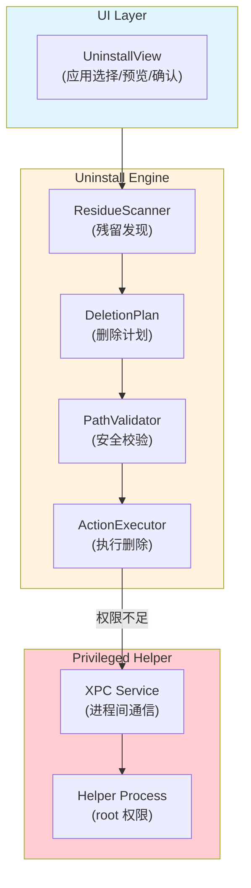
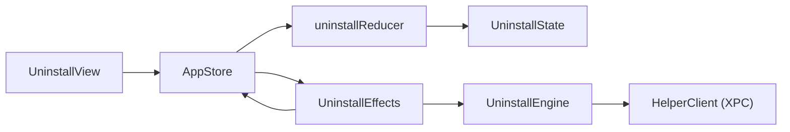
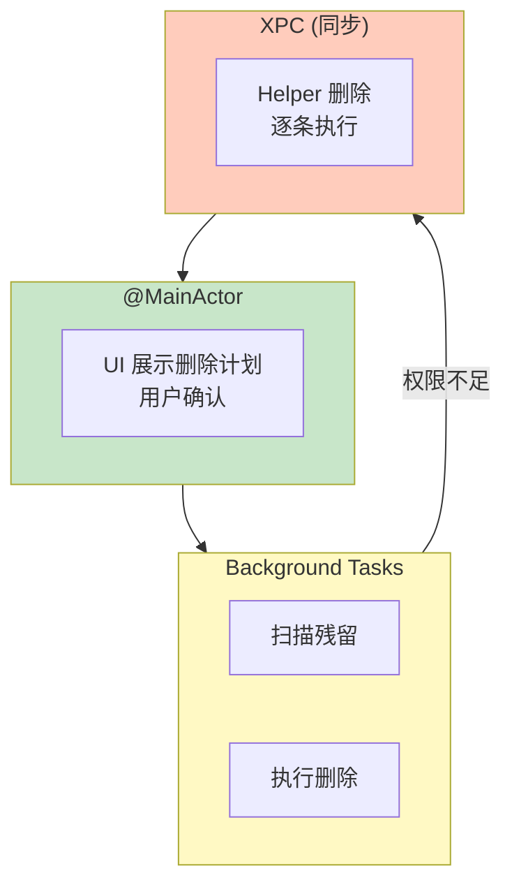

# SwiftSweep 卸载引擎与安全设计文档

**项目名称**：SwiftSweep - 应用卸载与残留清理引擎  
**作者 / 时间**：2026-01-01  
**项目类型**：客户端安全 / 系统工具 / 工程能力展示  
**适用平台**：macOS

---

## 1. 背景（Background）

在 macOS 应用卸载场景下，现有实现存在以下问题：

1. **残留泛滥**：Finder 删除 .app 后，~/Library 下存在大量残留（缓存、偏好、数据）
2. **路径遍历风险**：恶意路径（软链接逃逸）可能导致删除非预期文件
3. **权限不足**：非特权进程无法删除 /Library 下的系统级残留
4. **误删风险**：激进清理可能破坏系统或其他应用依赖

这些问题在以下场景尤为明显：
- 用户频繁安装/卸载开发工具（Xcode、Docker）
- 第三方应用残留配置导致重装后异常
- 需要彻底清理时缺乏可靠工具

---

## 2. 目标与非目标（Goals & Non-Goals）

### Goals
1. **完整卸载**：识别并清理应用关联的所有残留文件
2. **安全第一**：防止路径遍历、软链接逃逸攻击
3. **最小权限**：仅在必要时调用特权 Helper
4. **可预览**：删除前展示计划，用户确认后执行

### Non-Goals
- 不做实时文件系统监控（资源开销大）
- 不恢复已删除文件（非备份工具）
- 不支持 iOS/iPadOS 应用卸载

---

## 3. 需求与约束（Requirements & Constraints）

### 功能需求
| 需求 | 描述 |
|------|------|
| 残留扫描 | 根据 Bundle ID 搜索关联路径 |
| 删除计划 | 生成 DeletionPlan 供用户预览 |
| 分级删除 | 先尝试标准删除，失败后升级权限 |

### 非功能需求
| 类别 | 要求 |
|------|------|
| 安全 | 路径校验、Allowlist、Symlink 检测 |
| 稳定 | 删除失败不崩溃，记录错误 |
| 可审计 | 所有删除操作写入日志 |

### 约束条件
- **沙盒限制**：主进程受沙盒保护
- **代码签名**：Helper 需独立签名 + SMAppService 注册
- **Hardened Runtime**：不能 disable-library-validation

---

## 4. 方案调研与对比（Alternatives Considered）

### 权限提升方案

| 方案 | 优点 | 缺点 | 结论 |
|------|------|------|------|
| AppleScript `do shell… with admin` | 简单 | 每次弹窗，体验差 | ❌ |
| AuthorizationServices | 传统方案 | 复杂，不推荐 | ❌ |
| **SMAppService + XPC** | 现代、安全 | 实现成本高 | ✅ |

### 路径校验方案

| 方案 | 优点 | 缺点 | 结论 |
|------|------|------|------|
| 前缀匹配 | 简单 | 易被符号链接绕过 | ❌ |
| realpath + 前缀 | 解析链接 | 仍需 Allowlist | ⚠️ |
| **realpath + Allowlist + Containment** | 多层防护 | 复杂 | ✅ |

---

## 5. 整体架构设计（Design Overview）



### 模块职责

| 模块 | 职责 |
|------|------|
| `ResidueScanner` | 根据 Bundle ID 搜索常见残留路径 |
| `DeletionPlan` | 聚合待删除路径，计算可回收空间 |
| `PathValidator` | realpath 解析 + Allowlist 校验 |
| `ActionExecutor` | 执行删除，降级到 Helper |
| `Helper` | 以 root 权限删除 /Library 路径 |

### 5.1 UDF 接入（当前实现）

卸载功能已接入 UDF 分层：UI 不直接触发异步任务，而是通过 Store 派发 Action，Effects 负责调用引擎并回写状态。



**状态与动作（节选）**
- `UninstallState`: `apps`, `selectedAppID`, `residuals`, `deletionPlan`, `deletionResult`, `pendingSelectionURL`。
- `UninstallAction`: `startScan`, `scanCompleted`, `setPendingSelection`, `selectApp`, `prepareUninstall`, `planCreated`, `startDelete`, `deleteCompleted`。

**现状说明**
- 扫描/残留加载仍使用 `Task.detached`，后续将接入 `ConcurrentScheduler` 统一调度。
- Apple App 卸载安全校验仍需要在 UDF 流中恢复（路径校验与设置 gating）。

---

## 6. 关键设计点（Key Design Decisions）

### 6.1 多层安全校验

```swift
func validatePath(_ path: String) throws {
    // 1. realpath 解析，消除符号链接
    let resolved = try resolvePath(path)
    
    // 2. Allowlist 前缀检查
    guard isInAllowedPrefix(resolved) else {
        throw SecurityError.pathNotAllowed
    }
    
    // 3. 容器化检查（不能逃逸到父目录）
    guard !resolved.contains("/../") else {
        throw SecurityError.pathTraversal
    }
}
```

**原因**：单层检查可被绕过  
**代价**：每个路径需多次 I/O 调用

### 6.2 删除计划预览

```swift
struct DeletionPlan {
    let items: [DeletionItem]
    let totalBytes: Int64
    let riskLevel: RiskLevel
    
    func preview() -> DeletionPreview { ... }
    func execute() async throws -> DeletionResult { ... }
}
```

**原因**：用户知情同意，避免误删  
**代价**：增加一步交互

### 6.3 权限降级策略

```
尝试 FileManager.default.removeItem()
    ↓ 成功 → return
    ↓ EPERM/EACCES
调用 HelperClient.delete(path)
    ↓ 成功 → return
    ↓ 失败 → 记录错误，继续下一个
```

**原因**：最小权限原则，减少 Helper 调用  
**代价**：首次删除可能失败后重试

---

## 7. 并发与线程模型（Concurrency Model）



### XPC 调用特点
- 同步阻塞（简化错误处理）
- 每条路径单独调用（避免批量失败）
- 超时 30s

---

## 8. 性能与资源管理（Performance & Resource Management）

| 场景 | 策略 |
|------|------|
| 大量残留 | 批量展示，分页删除 |
| 大文件 | 异步删除，进度回调 |
| Helper 调用 | 减少次数，合并路径 |

---

## 9. 风险与权衡（Risks & Trade-offs）

| 风险 | 影响 | 缓解 |
|------|------|------|
| Allowlist 过严 | 漏删残留 | 持续维护，用户反馈 |
| Allowlist 过松 | 误删系统文件 | 保守默认，可配置 |
| Helper 被滥用 | 安全漏洞 | XPC 白名单校验 |

---

## 10. 验证与效果（Validation）

### 测试矩阵

| Case | 验证方法 |
|------|----------|
| 正常卸载 | 自动化测试 |
| 符号链接逃逸 | 手动构造攻击路径 |
| 权限不足 | 测试 /Library 路径 |
| 取消操作 | UI 测试 |

### 安全审计
- 定期 Review Allowlist
- 日志分析异常删除模式

---

## 11. 可迁移性（macOS → iOS）

| 组件 | 通用性 | 适配点 |
|------|--------|--------|
| PathValidator | ✅ | 路径调整 |
| DeletionPlan | ✅ | 无 |
| Helper | ❌ | iOS 无特权进程 |

---

## 12. 后续规划（Future Work）

1. **智能 Allowlist**：根据应用类型动态生成
2. **回收站恢复**：移入废纸篓而非直接删除
3. **批量卸载**：支持多应用同时卸载

---

## 13. 总结（Takeaways）

本项目展示了**在 macOS 安全约束下，设计多层防护的文件删除系统**的能力。

核心价值：
- **安全**：realpath + Allowlist + Containment 三层防护
- **最小权限**：标准删除 → Helper 降级
- **可审计**：完整删除日志
