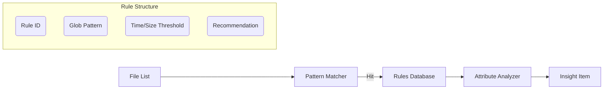

# 项目设计文档：智能建议与规则引擎

**项目名称**：SwiftSweep - Smart Insights & Rules Engine
**作者 / 时间**：JadeSnow7 / 2026-01-02
**项目类型**：规则引擎 / 智能决策 / 工程能力展示
**适用平台**：macOS

---

## 1. 背景（Background）

在早期的系统清理工具中，往往只是简单罗列出“所有大文件”或“所有缓存”，把决策压力完全抛给用户。用户在面对成百上千个文件时，最大的痛点是：
1.  **不敢删**：不知道删了这个文件会有什么后果。
2.  **效率低**：需要逐个确认，无法批量处理安全文件。
3.  **缺乏上下文**：只看到文件名，不知道属于哪个应用。

我们需要一个“智能层”，能够根据文件路径特征，自动判定其安全等级，并给出清理建议。

---

## 2. 目标与非目标（Goals & Non-Goals）

### Goals
-   **可解释性 (Explainability)**：每条建议必须附带“证据 (Evidence)”，说明为什么推荐删除（例如：最后访问时间 > 1年）。
-   **分级决策**：将文件分类为 Safe (安全可删), Caution (需谨慎), Keep (建议保留)。
-   **零配置**：开箱即用，内置常见能够识别垃圾文件的规则（Xcode, Node, Gradle 等）。

### Non-Goals
-   **不借助 LLM 进行实时决策**：为了性能和隐私，规则匹配完全基于本地正则/Glob，不上传文件名给大模型。
-   **不自动删除**：始终需要用户最终确认。

---

## 3. 需求与约束（Requirements & Constraints）

### 功能需求
1.  **规则定义**：支持 JSON 格式定义规则（路径模式、文件类型、时间阈值）。
2.  **上下文关联**：识别文件归属的 App（通过 Bundle ID 或路径特征）。
3.  **证据链**：在 UI 上展示决策依据（如“30天未访问”）。

### 非功能需求
-   **匹配速度**：在百万级文件列表上应用规则，耗时 < 1秒。

### 约束条件
-   **沙盒**：只能对已授权目录内的文件应用规则。

---

## 4. 方案调研与对比（Alternatives Considered）🔥

| 方案 | 优点 | 缺点 | 结论 |
| :--- | :--- | :--- | :--- |
| **硬编码 `if-else`** | 简单直接，编译器优化 | 无法热更新；逻辑分散难以维护。 | ❌ |
| **嵌入式脚本 (Lua/JS)** | 极其灵活 | 引入运行时开销；不可控的安全风险。 | ❌ |
| **申明式规则 (JSON/YAML)** | **数据与逻辑分离；易于测试；支持热更新。** | **表达能力受限于预定义的 Operator。** | ✅ |

**最终选择**：JSON 申明式规则引擎，配合 Swift 强类型解析。

---

## 5. 整体架构设计（Design Overview）

### 引擎架构



-   **Pattern Matcher**: 使用 Trie 树或高效的 Glob 匹配库，快速筛选候选文件。
-   **Attribute Analyzer**: 对命中规则的文件，进一步检查元数据（atime, size）。
-   **Insight Item**: 最终生成的建议对象，包含 `id`, `description`, `confidenceLevel`。

---

## 6. 关键设计点（Key Design Decisions）

### 6.1 证据 (Evidence) 对象的设计
*   **设计**：每个 Insight 包含一个 `[Evidence]` 数组。
*   **结构**：
    ```swift
    struct Evidence {
        let type: EvidenceType // e.g., .oldAge, .unusedApp, .cachePattern
        let description: String
        let weight: Float
    }
    ```
*   **作用**：UI 可以渲染成“✅ 超过90天未访问”、“✅ 属于已卸载的应用”，增强用户信任度。

### 6.2 信心分数 (Confidence Score)
*   **逻辑**：综合多条证据计算信心分。只有分数 > 0.8 才标记为 `HighConfidence` 并自动勾选。
*   **原因**：防止单一规则误判（例如用户只是最近没打开 Xcode，但并不是不想用）。

---

## 7. 并发与线程模型（Concurrency Model）

-   **并行评估**：规则评估是 CPU 密集型操作。使用 `ConcurrentScheduler` 将文件列表切片，并行评估。
-   **无锁设计**：规则库是只读的，可以安全地在多个线程间共享。

---

## 8. 性能与资源管理（Performance & Resource Management）

-   **预编译正则**：所有 Regex 在引擎初始化时预编译，避免循环中重复编译。
-   **短路求值**：如果文件大小不满足阈值，直接跳过正则匹配（因为文件属性检查比字符串匹配快得多）。

---

## 9. 风险与权衡（Risks & Trade-offs）

-   **规则过时**：App 路径结构改变可能导致规则失效。
    -   *应对*：通过插件系统（TS_002）支持规则热更新。
-   **误报**：错误地建议删除重要配置。
    -   *应对*：设计“白名单”机制，且默认策略倾向于“Keep”而非“Delete”。

---

## 10. 验证与效果（Validation）

-   **单元测试**：构造虚拟文件系统，针对每条规则编写 Test Case。
-   **回归测试**：确保新规则不仅能匹配新文件，且不会误伤已知的重要文件。

---

## 11. 可迁移性（macOS → iOS）

-   **通用性**：规则引擎逻辑完全通用。
-   **数据差异**：iOS 的文件结构完全不同，需要维护两套规则库（Rule Set）。

---

## 12. 后续规划（Future Work）

1.  **用户学习**：如果用户取消勾选某类文件，降低该规则的权重。
2.  **云端规则库**：构建社区驱动的规则库 (Community Rules)。

---

## 13. 总结（Takeaways）

Smart Insights 引擎将“文件清理”从单纯的 I/O 操作提升到了“知识服务”的层面。通过**显式化的证据链**和**透明的信心分数**，我们解决了用户与工具之间的信任问题，这是清理类工具最核心的壁垒。
