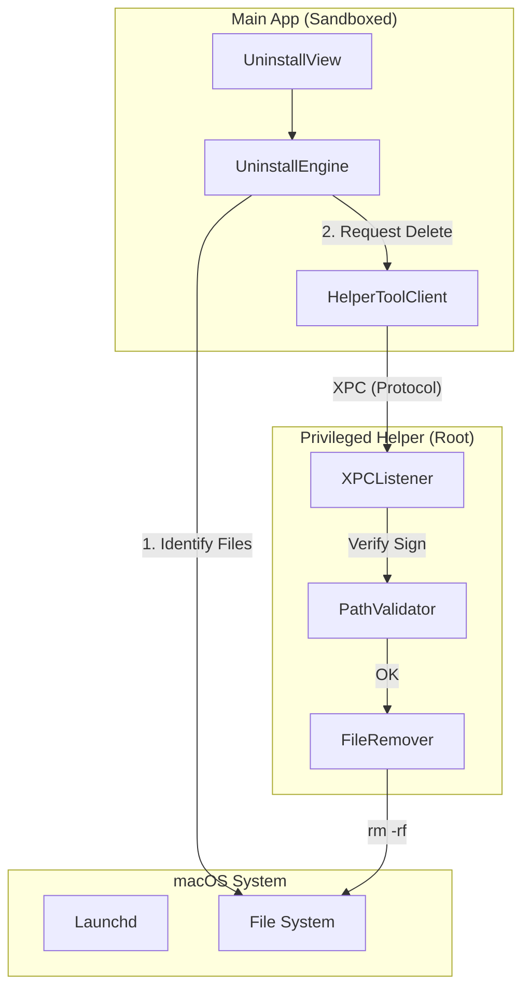

# 项目设计文档：应用卸载引擎与特权辅助

**项目名称**：SwiftSweep - Secure Uninstall Engine & Privileged Helper
**作者 / 时间**：JadeSnow7 / 2026-01-02
**项目类型**：系统工具 / 安全 / IPC 通信
**适用平台**：macOS

---

## 1. 背景（Background）

在 macOS 上卸载应用通常只需将 App 拖入废纸篓，但这往往会残留大量的关联文件（Preference, Application Support, Caches, Logs）。这些残留文件：
1.  **占用空间**：长期积累可达数 GB。
2.  **配置冲突**：重装应用后，旧的错误配置可能导致应用无法启动。
3.  **隐私风险**：残留的日志可能包含敏感信息。

同时，删除这些文件面临权限挑战：部分文件属于系统目录或受保护路径，App Sandbox 无法直接删除。

---

## 2. 目标与非目标（Goals & Non-Goals）

### Goals
-   **关联查找**：精准识别与 App 关联的所有分散文件。
-   **特权删除**：通过 Privileged Helper Tool 安全地删除受保护文件，无需用户反复输入密码。
-   **安全校验**：严防“误删系统文件”，建立多重路径检查机制。

### Non-Goals
-   **不修改系统配置**：仅删除文件，不执行 defaults delete 等可能影响全局配置的命令。
-   **不卸载系统应用**：禁止卸载 Safari, Mail 等系统内置 App。

---

## 3. 需求与约束（Requirements & Constraints）

### 功能需求
1.  **扫描关联文件**：根据 Bundle ID, App Name, Vendor Name 在标准目录中查找匹配项。
2.  **Privileged Helper**：安装一个 `launchd` 守护进程（Daemon），以 root 权限运行。
3.  **XPC 通信**：主 App 与 Helper 之间通过 XPC 进行安全通信。

### 非功能需求
-   **安全性**：Helper 必须验证调用方的代码签名 (`SecCodeCheckValidity`)。

### 约束条件
-   **Sandbox**：主 App 运行在沙盒中。
-   **SMAppService**：使用现代 API 安装 Helper (macOS 13+)。

---

## 4. 方案调研与对比（Alternatives Considered）🔥

### 权限提升方案

| 方案 | 优点 | 缺点 | 结论 |
| :--- | :--- | :--- | :--- |
| **每次 `sudo rm`** | 简单 | 用户体验极差（反复输密码）；不安全。 | ❌ |
| **`NSAppleScript`** | 可调用 `do shell script with administrator privileges` | 也会弹窗；AppleScript 逐渐被废弃。 | ❌ |
| **Privileged Helper (XPC)** | **一次授权，永久有效；细粒度权限控制；Apple 推荐。** | **开发复杂度最高（需处理签名、安装、XPC）。** | ✅ |

### 关联文件查找方案

| 方案 | 优点 | 缺点 | 结论 |
| :--- | :--- | :--- | :--- |
| **Spotlight (`mdfind`)** | 速度快 | 索引可能不完整；无法精确控制匹配逻辑。 | ❌ |
| **BOM 解析 (`pkgutil`)** | 极其准确 | 仅适用于 PKG 安装的应用；大多数 Mac App 是拖拽安装的。 | ❌ |
| **规则启发式扫描** | **覆盖面广；可定制规则。** | **可能误报，需严格校验。** | ✅ |

**最终选择**：XPC Helper + 启发式扫描引擎。

---

## 5. 整体架构设计（Design Overview）

### C/S 架构

1.  **Main App**: 负责扫描文件，生成“删除清单”。
2.  **XPC Protocol**: 定义 `deleteItem(at url, authData, reply)` 接口。
3.  **Helper**: 接收请求，校验调用者签名，校验路径安全性，执行删除。

---

## 6. 关键设计点（Key Design Decisions）

### 6.1 安全路径校验 (Safe Path Validation)
*   **设计**：Helper 内部维护一个 `DeleteAllowList` 和 `SystemBlockList`。
*   **规则**：
    -   必须是 `/Applications`, `/Library`, `/Users` 下的文件。
    -   禁止删除 `/System`, `/usr`, `/bin`。
    -   禁止删除 `*` (通配符) 或 `..` (相对路径)。
*   **原因**：Helper 拥有 root 权限，一旦被恶意利用或产生 Bug，可能损毁系统。

### 6.2 代码签名校验 (Code Signing Requirement)
*   **设计**：Helper 在 `listener(_:shouldAcceptNewConnection:)` 中检查对端的 `audit_token`。
*   **验证内容**：Team ID 必须匹配当前开发者 Team ID，Bundle ID 必须匹配主 App。
*   **原因**：防止其他恶意 App 伪装成 SwiftSweep 调用 Helper 删除文件。

---

## 7. 并发与线程模型（Concurrency Model）

-   **XPC 异步**：XPC 调用天然是异步的。Client 端使用 `withCheckedThrowingContinuation` 将回调风格封装为 `async/await`。
-   **Helper 并发**：Helper 默认是多线程处理 XPC 请求的，需注意文件操作的原子性。

---

## 8. 性能与资源管理（Performance & Resource Management）

-   **按需连接**：Helper 仅在需要执行特权操作时建立连接。
-   **自动退出**：Helper 实现空闲超时机制，若 5 分钟无请求自动退出（由 launchd 再次唤醒），减少常驻内存。

---

## 9. 风险与权衡（Risks & Trade-offs）

-   **Helper 安装失败**：`SMAppService` 可能因系统策略被拦截。
    -   *应对*：UI 提供详细的引导（“请在系统设置允许后台项目”），并提供降级方案（提示用户手动删除）。
-   **误删用户文件**：
    -   *权衡*：默认移动到废纸篓 (`Trash`)，而不是直接 `rm`。对于 Helper (Root) 删除的文件，尝试移动到 `/Users/<user>/.Trash` (需处理权限修正)。

---

## 10. 验证与效果（Validation）

-   **安全攻防测试**：尝试发送 `/etc/hosts` 删除请求，验证 Helper 是否拒绝。
-   **卸载测试**：安装 Chrome，运行卸载，验证是否清理了 `~/Library/Application Support/Google/Chrome`。

---

## 11. 可迁移性（macOS → iOS）

-   **完全不可迁移**：iOS 不支持 XPC Service，不支持特权提升，应用间沙盒完全隔离。此模块仅限 macOS。

---

## 12. 后续规划（Future Work）

1.  **卸载向导**：当用户将 App 拖入废纸篓时，监测文件系统事件，自动弹出“检测到卸载行为，是否清理残留？”的提示。
2.  **快照对比**：安装 App 前后建立文件系统快照，差异对比实现 100% 精确残留识别。

---

## 13. 总结（Takeaways）

本模块是 SwiftSweep 最核心的“系统工具”属性的体现。通过严格的安全设计（路径白名单、签名校验）和通过 XPC 实现的权限分离由，我们构建了一个既强大又安全的特权执行环境，这是 macOS 高级开发必须掌握的能力。
