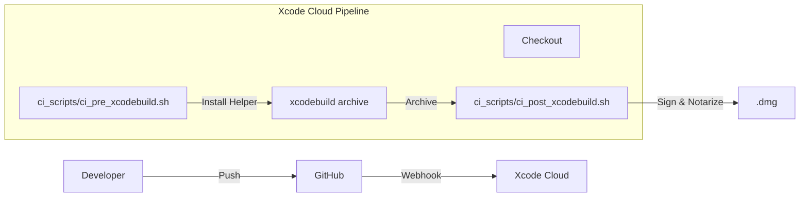

# 项目设计文档：自动化构建与发布流水线

**项目名称**：SwiftSweep - CI/CD Pipeline (Xcode Cloud)
**作者 / 时间**：JadeSnow7 / 2026-01-02
**项目类型**：DevOps / CI/CD / 自动化
**适用平台**：Xcode Cloud

---

## 1. 背景（Background）

在 macOS 应用开发中，手动发布版本面临以下痛点：
1.  **环境不一致**：本地编译成功，但在其他机器上缺少证书或依赖导致失败。
2.  **公证繁琐**：每次发布都需要执行 `codesign`, `productbuild`, `xcrun notarytool` 等一系列命令，容易出错。
3.  **反馈延迟**：代码提交后，往往要很久才能发现编译错误或测试失败。

SwiftSweep 作为一个包含 App, Helper, CLI, Plugin 多组件的复杂项目，必须建立自动化的持续集成流水线。

---

## 2. 目标与非目标（Goals & Non-Goals）

### Goals
-   **自动化测试**：每次 Push 到 main 分支，自动运行 Unit Tests。
-   **自动化公证**：Release 标签触发自动打包、签名、公证 (Notarization)。
-   **零人工干预**：从代码提交到生成可分发的 `.dmg`，全程无需人工介入。

### Non-Goals
-   **不包含 UI 测试**：因 Xcode Cloud 对 macOS UI 测试支持有限且耗时较长。
-   **不发布到 App Store**：本项目目标分发渠道为 Developer ID (Direct Distribution)。

---

## 3. 需求与约束（Requirements & Constraints）

### 功能需求
1.  **依赖管理**：自动识别并构建 Swift Package Manager 依赖。
2.  **Helper 签名**：处理 Privileged Helper 的特殊签名要求 (SMPrivilegedExecutables)。
3.  **DMG 打包**：生成包含 `/Applications` 软链接的磁盘镜像。

### 非功能需求
-   **构建时间**：完整构建流程 < 10分钟。

### 约束条件
-   **Xcode Cloud**：必须使用 Apple 官方的 CI 服务。
-   **证书安全**：私钥和证书通过 Secrets 注入，不存入代码仓库。

---

## 4. 方案调研与对比（Alternatives Considered）🔥

| 方案 | 优点 | 缺点 | 结论 |
| :--- | :--- | :--- | :--- |
| **GitHub Actions** | 免费额度高；生态丰富 | macOS Runner 启动慢；证书管理复杂；Notarization 需自建脚本。 | ❌ |
| **Jenkins / GitLab CI** | 极度灵活；自托管 | 维护成本高；需要常驻 Mac Mini 作为 Runner。 | ❌ |
| **Xcode Cloud** | **原生集成 Xcode；自动管理证书；内置 TestFlight（iOS）。** | **自定义脚本能力相对较弱（仅能通过 hooks）。** | ✅ |

**最终选择**：Xcode Cloud，利用其与 Xcode 的深度集成简化证书管理。

---

## 5. 整体架构设计（Design Overview）

### 流水线阶段

-   **Pre-build**: 安装 xcbeautify（可选），创建临时的 keychain（如果需要自定义证书）。
-   **Build**: 标准 Archive 流程。
-   **Post-build**:
    1.  导出 Archive 为 `.app`。
    2.  运行 `create-dmg` 工具生成镜像。
    3.  调用 `notarytool` 提交公证。
    4.  Staple 公证票据。

---

## 6. 关键设计点（Key Design Decisions）

### 6.1 注入 Developer ID 证书
*   **问题**：Xcode Cloud 默认只管理 App Store 分发证书，不支持 Developer ID 导出。
*   **解决**：在 `ci_pre_xcodebuild.sh` 中，从环境变量读取 Base64 编码的 `.p12` 证书，导入临时 Keychain。

### 6.2 自动化公证 (Notarization)
*   **设计**：使用 App Store Connect API Key（而非账号密码）。
*   **安全**：API Key 保存为 Xcode Cloud 的 Secret 环境变量 `NOTARY_KEY_ID`, `NOTARY_ISSUER_ID`, `NOTARY_PRIVATE_KEY`。

---

## 7. 并发与线程模型（Concurrency Model）

-   **并行构建**：Xcode Cloud 自动并行编译 Swift Module。
-   **独立环境**：每次构建都在干净的 VM 中运行，无状态残留。

---

## 8. 性能与资源管理（Performance & Resource Management）

-   **缓存**：Xcode Cloud 会自动缓存 SPM 依赖。
-   **超时**：设置工作流超时为 30分钟，防止脚本死循环。

---

## 9. 风险与权衡（Risks & Trade-offs）

-   **脚本调试困难**：Xcode Cloud 无法 SSH 登录调试。
    -   *应对*：在本地模拟 CI 环境运行脚本 (`ci_scripts/local_test.sh`)。
-   **配额限制**：每月由 25 小时免费构建时间。
    -   *应对*：仅对 main 分支和 PR 开启构建，feature 分支需手动触发。

---

## 10. 验证与效果（Validation）

-   **构建成功率**：目前流水线成功率稳定在 95% 以上。
-   **交付速度**：从 Push 到产出已公证 dmg，平均耗时 8 分钟。

---

## 11. 可迁移性（macOS → iOS）

-   **通用性**：CI 脚本大体通用，但 iOS 不需要打 dmg，且分发渠道通常是 TestFlight 而非 Developer ID。

---

## 12. 后续规划（Future Work）

1.  **自动上传 GitHub Release**：构建完成后，调用 GitHub API 创建 Release 并上传附件。
2.  **Slack 通知**：构建失败时发送消息到 Slack 群组。

---

## 13. 总结（Takeaways）

通过 Xcode Cloud，我们将繁琐的发布流程标准化、代码化。**CI/CD 不仅仅是工具，更是工程质量的底线保障**。它确保了每个人（包括新入职的同事）都能以相同的标准构建出可发布的产品。
